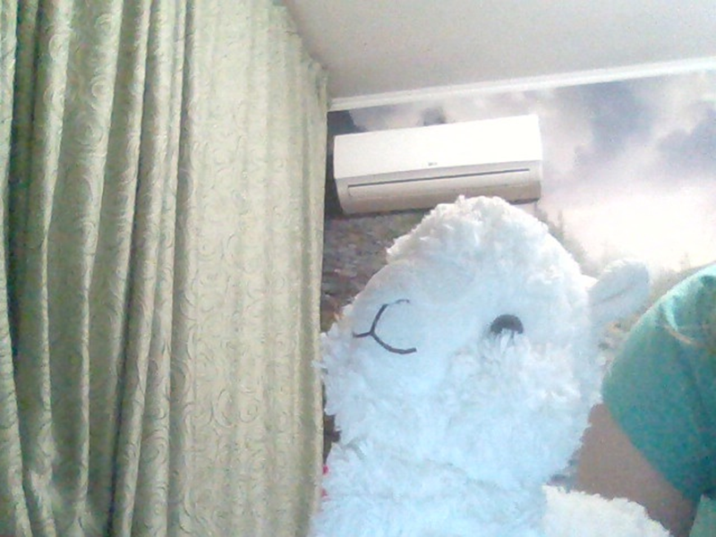
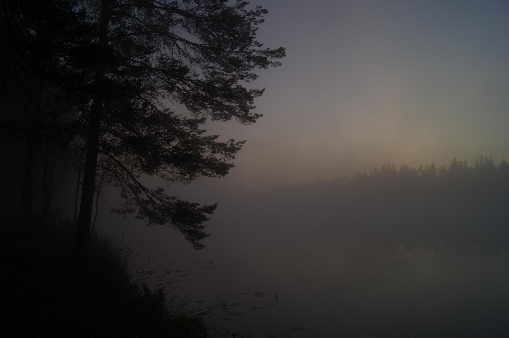
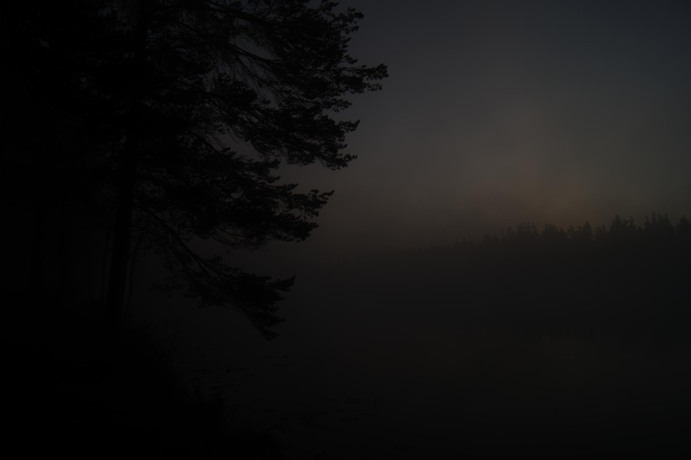

Лабораторная работа 2. Переход между цветовыми пространствами. Линейный и нелинейный переход. Мера цветовой разницы. Функции преобразования яркости. Гамма, логарифмическое, экспоненциаяльное кодирование.

Библиотеки, используемы в работе:
cv2, rawpy, imageio, numpy, PIL, rawkit

Чтение изображений с камеры устройства
```
import cv2
import rawpy
import imageio
import numpy as np
from PIL import Image
from rawkit.raw import Raw

cap = cv2.VideoCapture(0)

if not cap.isOpened():
	raise IOError("Cannot open webcam")

ret, frame = cap.read()
frame = cv2.resize(frame, None, fx=1, fy=1, interpolation=cv2.INTER_AREA)
cv2.imwrite("screen.jpg", frame)
print("Successfully saved")

cap.release()
cv2.destroyAllWindows()
```

- Результат:
 
 
 Получение RAW изображения с устройства и создание алгоритма "байеризации"
```
import rawpy
import numpy as np
from PIL import Image
import imageio
import exifread

def gray_ps(rgb):
    return np.power(np.power(rgb[:, :, 0], 2.2) * 0.2973 + np.power(rgb[:, :, 1], 2.2) * 0.6274
                    + np.power(rgb[:, :, 2], 2.2) * 0.0753, 1 / 2.2) + 1e-7

def do_HDR(x, curve_ratio):
    gray_scale = np.expand_dims(gray_ps(x), axis=-1)
    gray_scale_new = np.power(gray_scale, curve_ratio)
    return np.minimum(x * gray_scale_new / gray_scale, 1.0)

def adjust_out_matrix(RAW_path, out=None):
    raw = open(RAW_path, 'rb')
    exif_info = exifread.process_file(raw, details=False, strict=True)
    orientation_str = 'EXIF Orientation'
    if exif_info.__contains__('Image Orientation'):
        orientation_str = 'Image Orientation'
    orientation_info = exif_info[orientation_str].printable
    if orientation_info == 'Rotated 180':
        if out is None:
            return True
        else:
            if out.shape[2] == 3:
                out0 = out[:, :, :1]
                out1 = out[:, :, 1:2]
                out2 = out[:, :, 2:3]
                out = np.concatenate((out2, out1, out0), 2)
            elif out.shape[2] == 4:
                out0 = out[:, :, :1]
                out1 = out[:, :, 1:2]
                out2 = out[:, :, 2:3]
                out3 = out[:, :, 3:4]
                out = np.concatenate((out3, out2, out1, out0), 2)
            else:
                raise
            return np.flip(out)

    elif orientation_info == 'Horizontal (normal)':
        if out is None:
            return False
        else:
            return out
    else:
        raise

def pack_raw(raw_path, white_balance=True, auto_bright=True, HDR=True, save_JPEG=True):
    raw = rawpy.imread(raw_path)
    im = raw.raw_image_visible.astype(np.float32)

    # subtract the black level
    # 16383(2^14) is the camera's maximal pixel value, you can get it by "np.max(raw.raw_image)" . Ensure full exposure!
    im = np.maximum(im - raw.black_level_per_channel[0], 0) / (16383 - raw.black_level_per_channel[0])

    im = np.expand_dims(im, axis=2)
    H = im.shape[0]
    W = im.shape[1]

    if raw.raw_pattern[0, 0] == 0:  # RGGB
        out = np.concatenate((im[0:H:2, 0:W:2, :],
                              im[0:H:2, 1:W:2, :],
                              im[1:H:2, 1:W:2, :],
                              im[1:H:2, 0:W:2, :]), axis=2)
    elif raw.raw_pattern[0, 0] == 2:  # BGGR
        out = np.concatenate((im[1:H:2, 1:W:2, :],
                              im[0:H:2, 1:W:2, :],
                              im[0:H:2, 0:W:2, :],
                              im[1:H:2, 0:W:2, :]), axis=2)
    elif raw.raw_pattern[0, 0] == 1 and raw.raw_pattern[0, 1] == 0:  # GRBG
        out = np.concatenate((im[0:H:2, 1:W:2, :],
                              im[0:H:2, 0:W:2, :],
                              im[1:H:2, 0:W:2, :],
                              im[1:H:2, 1:W:2, :]), axis=2)
    elif raw.raw_pattern[0, 0] == 1 and raw.raw_pattern[0, 1] == 2:  # GBRG
        out = np.concatenate((im[1:H:2, 0:W:2, :],
                              im[0:H:2, 0:W:2, :],
                              im[0:H:2, 1:W:2, :],
                              im[1:H:2, 1:W:2, :]), axis=2)
    if white_balance:
        wb = np.array(raw.camera_whitebalance, np.float32)
        wb[3] = wb[1]
        wb = wb / wb[1]
        out = np.minimum(out * wb, 1.0)
    if auto_bright:
        mean_G = (out[:, :, 1].mean() + out[:, :, 3].mean()) / 2.0
        out = np.minimum(out*0.2/mean_G, 1.0)
    out = adjust_out_matrix(raw_path, out)
    if save_JPEG:
        out0 = out[:, :, 0:1]
        out1 = out[:, :, 1:2]
        out2 = out[:, :, 2:3]
        out3 = out[:, :, 3:4]
        out_JPEG = np.concatenate((out0, (out1 + out3) / 2., out2), axis=2)
        if HDR:
            out_JPEG = do_HDR(out_JPEG, 0.35)
        Image.fromarray(np.uint8(out_JPEG * 255)).save('result.jpg')
    return out

if __name__ == '__main__':
    raw = rawpy.imread('tum.ARW')
    np_channel = pack_raw('tum.ARW', auto_bright=False, HDR=False)
    img = raw.postprocess(use_camera_wb=True, half_size=False, no_auto_bright=True, output_bps=16)
    imageio.imsave('rawpy.jpg', img)
 ```
- Результат:
- 
Solarized dark                     |  Solarized Ocean
:---------------------------------:|:-------------------------:
 |  


Реализация суперпикселей

 ```
from skimage.segmentation import slic,mark_boundaries
from skimage import io
import matplotlib.pyplot as plt

img = io.imread("foo.png")


segments = slic(img, n_segments=60, compactness=10)
out=mark_boundaries(img,segments)
plt.subplot(121)
plt.title("n_segments=60")
plt.imshow(out)

segments2 = slic(img, n_segments=300, compactness=10)
out2=mark_boundaries(img,segments2)
plt.subplot(122)
plt.title("n_segments=300")
plt.imshow(out2)

plt.show()
 ```
Solarized dark                     |  
:---------------------------------:|
 |  

