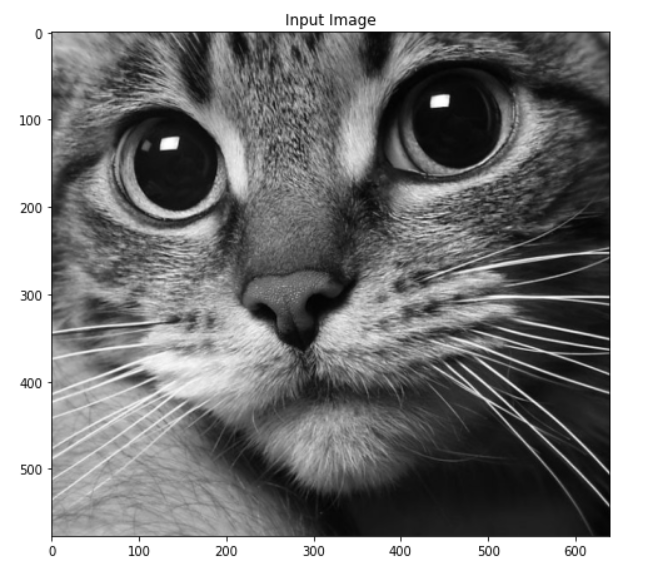
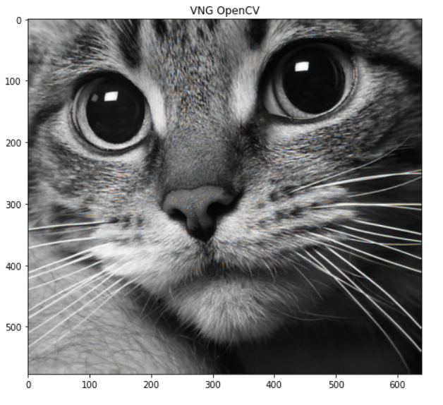
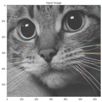
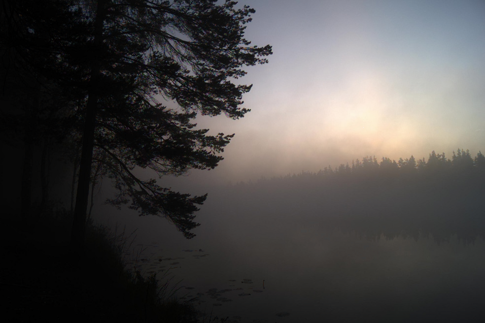

# Лабораторная работа 1. Получение изображений. Работа с RAW изображениями. Дебайеризация. Библиотеки работы с изображениями

Библиотеки, используемы в работе:
cv2, rawpy, imageio, numpy, PIL, rawkit, exifread, skimage, matplotlib, math

## Чтение изображений с камеры устройства
```
import cv2
import rawpy
import imageio
import numpy as np
from PIL import Image
from rawkit.raw import Raw

cap = cv2.VideoCapture(0)

if not cap.isOpened():
	raise IOError("Cannot open webcam")

ret, frame = cap.read()
frame = cv2.resize(frame, None, fx=1, fy=1, interpolation=cv2.INTER_AREA)
cv2.imwrite("screen.jpg", frame)
print("Successfully saved")

cap.release()
cv2.destroyAllWindows()
```
Результат чтения изображения с камеры ноутбука:                          |  
:--------------------------------------:|
  |  
 
 
 
 
 ##  Байеризация
 
```
     public BufferedImage bayer(BufferedImage bufferedImage) throws IOException {
        BufferedImage result = new BufferedImage(bufferedImage.getWidth(), bufferedImage.getHeight(), TYPE_INT_ARGB);
        int bg = 255;
        IntStream.range(0, result.getHeight()).forEach(y ->
                IntStream.range(0, result.getWidth()).forEach(x -> {
                    if (y % 2 == 0) { //rows 0 and 2
                        if (x % 2 == 0) { //only red
                            result.setRGB(x, y, color(ch1(bufferedImage.getRGB(x, y)), bg, bg, bg));
                        } else { //only green
                            result.setRGB(x, y, color(ch2(bufferedImage.getRGB(x, y)), bg, bg, bg));
                        }
                    } else { //rows 1 and 3
                        if (x % 2 == 0) { //only green
                            result.setRGB(x, y, color(ch2(bufferedImage.getRGB(x, y)), bg, bg, bg));
                        } else { //only blue
                            result.setRGB(x, y, color(ch3(bufferedImage.getRGB(x, y)), bg, bg, bg));
                        }
                    }
                })
        );
        save(result, "result/1lab", "bayerRes", "png");
        return result;
    }
Оригинал                     | Результат байеризации |
:---------------------------------:|:-------------------------:
 |  
```


 
## Получение RAW изображения с устройства и создание алгоритма "байеризации"
```
import rawpy
import numpy as np
from PIL import Image
import imageio
import exifread

def gray_ps(rgb):
    return np.power(np.power(rgb[:, :, 0], 2.2) * 0.2973 + np.power(rgb[:, :, 1], 2.2) * 0.6274
                    + np.power(rgb[:, :, 2], 2.2) * 0.0753, 1 / 2.2) + 1e-7

def do_HDR(x, curve_ratio):
    gray_scale = np.expand_dims(gray_ps(x), axis=-1)
    gray_scale_new = np.power(gray_scale, curve_ratio)
    return np.minimum(x * gray_scale_new / gray_scale, 1.0)

def adjust_out_matrix(RAW_path, out=None):
    raw = open(RAW_path, 'rb')
    exif_info = exifread.process_file(raw, details=False, strict=True)
    orientation_str = 'EXIF Orientation'
    if exif_info.__contains__('Image Orientation'):
        orientation_str = 'Image Orientation'
    orientation_info = exif_info[orientation_str].printable
    if orientation_info == 'Rotated 180':
        if out is None:
            return True
        else:
            if out.shape[2] == 3:
                out0 = out[:, :, :1]
                out1 = out[:, :, 1:2]
                out2 = out[:, :, 2:3]
                out = np.concatenate((out2, out1, out0), 2)
            elif out.shape[2] == 4:
                out0 = out[:, :, :1]
                out1 = out[:, :, 1:2]
                out2 = out[:, :, 2:3]
                out3 = out[:, :, 3:4]
                out = np.concatenate((out3, out2, out1, out0), 2)
            else:
                raise
            return np.flip(out)

    elif orientation_info == 'Horizontal (normal)':
        if out is None:
            return False
        else:
            return out
    else:
        raise

def pack_raw(raw_path, white_balance=True, auto_bright=True, HDR=True, save_JPEG=True):
    raw = rawpy.imread(raw_path)
    im = raw.raw_image_visible.astype(np.float32)

  
    im = np.maximum(im - raw.black_level_per_channel[0], 0) / (np.max(raw.raw_image) - raw.black_level_per_channel[0])

    im = np.expand_dims(im, axis=2)
    H = im.shape[0]
    W = im.shape[1]

    if raw.raw_pattern[0, 0] == 0:  # RGGB
        out = np.concatenate((im[0:H:2, 0:W:2, :],
                              im[0:H:2, 1:W:2, :],
                              im[1:H:2, 1:W:2, :],
                              im[1:H:2, 0:W:2, :]), axis=2)
    elif raw.raw_pattern[0, 0] == 2:  # BGGR
        out = np.concatenate((im[1:H:2, 1:W:2, :],
                              im[0:H:2, 1:W:2, :],
                              im[0:H:2, 0:W:2, :],
                              im[1:H:2, 0:W:2, :]), axis=2)
    elif raw.raw_pattern[0, 0] == 1 and raw.raw_pattern[0, 1] == 0:  # GRBG
        out = np.concatenate((im[0:H:2, 1:W:2, :],
                              im[0:H:2, 0:W:2, :],
                              im[1:H:2, 0:W:2, :],
                              im[1:H:2, 1:W:2, :]), axis=2)
    elif raw.raw_pattern[0, 0] == 1 and raw.raw_pattern[0, 1] == 2:  # GBRG
        out = np.concatenate((im[1:H:2, 0:W:2, :],
                              im[0:H:2, 0:W:2, :],
                              im[0:H:2, 1:W:2, :],
                              im[1:H:2, 1:W:2, :]), axis=2)
    if white_balance:
        wb = np.array(raw.camera_whitebalance, np.float32)
        wb[3] = wb[1]
        wb = wb / wb[1]
        out = np.minimum(out * wb, 1.0)
    if auto_bright:
        mean_G = (out[:, :, 1].mean() + out[:, :, 3].mean()) / 2.0
        out = np.minimum(out*0.2/mean_G, 1.0)
    out = adjust_out_matrix(raw_path, out)
    if save_JPEG:
        out0 = out[:, :, 0:1]
        out1 = out[:, :, 1:2]
        out2 = out[:, :, 2:3]
        out3 = out[:, :, 3:4]
        out_JPEG = np.concatenate((out0, (out1 + out3) / 2., out2), axis=2)
        if HDR:
            out_JPEG = do_HDR(out_JPEG, 0.35)
        Image.fromarray(np.uint8(out_JPEG * 255)).save('result.jpg')
    return out

if __name__ == '__main__':
    raw = rawpy.imread('tum.ARW')
    np_channel = pack_raw('tum.ARW', auto_bright=False, HDR=False)
    img = raw.postprocess(use_camera_wb=True, half_size=False, no_auto_bright=True, output_bps=16)
    imageio.imsave('rawpy.jpg', img)
 ```

 
Преобразованное в jpg                     | Результат байеризации |
:---------------------------------:|:-------------------------:
 |  

##  Реализация биленейной интерполяции
 ```
public BufferedImage biLinear(BufferedImage bufferedImage) throws IOException {
        BufferedImage result = new BufferedImage(bufferedImage.getWidth(), bufferedImage.getHeight(), TYPE_INT_RGB);

        IntStream.range(1, result.getHeight() - 1).forEach(  y ->
                IntStream.range(1, result.getWidth() - 1).forEach( x -> {
            if (y % 2 == 0) { //rows 0 and 2
                if (x % 2 == 0) { //only red
                    int r = alpha(bufferedImage.getRGB(x, y));
                    int g = (alpha(bufferedImage.getRGB(x, y - 1)) +
                            alpha(bufferedImage.getRGB(x + 1, y)) +
                            alpha(bufferedImage.getRGB(x, y + 1)) +
                            alpha(bufferedImage.getRGB(x - 1, y))) / 4;
                    int b = (alpha(bufferedImage.getRGB(x - 1, y - 1)) +
                            alpha(bufferedImage.getRGB(x + 1, y - 1)) +
                            alpha(bufferedImage.getRGB(x - 1, y + 1)) +
                            alpha(bufferedImage.getRGB(x + 1, y + 1))) / 4;
                    result.setRGB(x, y, color(r, g, b));
                } else { //only green
                    int r = (alpha(bufferedImage.getRGB(x - 1, y)) +
                            alpha(bufferedImage.getRGB(x + 1, y))) / 2;
                    int g = alpha(bufferedImage.getRGB(x, y));
                    int b = (alpha(bufferedImage.getRGB(x, y - 1)) +
                            alpha(bufferedImage.getRGB(x, y + 1))) / 2;
                    result.setRGB(x, y, color(r, g, b));
                }
            } else { //rows 1 and 3
                if (x % 2 == 0) { //only green
                    int r = (alpha(bufferedImage.getRGB(x, y - 1)) +
                            alpha(bufferedImage.getRGB(x, y + 1))) / 2;
                    int g = alpha(bufferedImage.getRGB(x, y));
                    int b = (alpha(bufferedImage.getRGB(x - 1, y)) +
                            alpha(bufferedImage.getRGB(x + 1, y))) / 2;
                    result.setRGB(x, y, color(r, g, b));
                } else { //only blue
                    int r = (alpha(bufferedImage.getRGB(x - 1, y - 1)) +
                            alpha(bufferedImage.getRGB(x + 1, y - 1)) +
                            alpha(bufferedImage.getRGB(x - 1, y + 1)) +
                            alpha(bufferedImage.getRGB(x + 1, y + 1))) / 4;
                    int g = (alpha(bufferedImage.getRGB(x, y - 1)) +
                            alpha(bufferedImage.getRGB(x + 1, y)) +
                            alpha(bufferedImage.getRGB(x, y + 1)) +
                            alpha(bufferedImage.getRGB(x - 1, y))) / 4;
                    int b = alpha(bufferedImage.getRGB(x, y));
                    result.setRGB(x, y, color(r, g, b));
                }
            }
                })
        );

        save(result, "result/interp", "interpres", "png");
        return result;
    }
  ```
  Оригинал                     | Результат суперпикселей |
:---------------------------------:|:-------------------------:
 |  
  
##  Реализация суперпикселей

  ```
public BufferedImage superPixel(BufferedImage bufferedImage) throws IOException {
        BufferedImage result = new BufferedImage(bufferedImage.getWidth() / 2, bufferedImage.getHeight() / 2, TYPE_INT_RGB);

        for(int y=0; y< result.getHeight();y++){
            for(int x=0; x< result.getWidth();x++){
                int r = alpha(bufferedImage.getRGB(x * 2, y * 2));
                int g = (alpha(bufferedImage.getRGB(x * 2 + 1, y * 2)) +
                        alpha(bufferedImage.getRGB(x * 2, y * 2 + 1))) / 2;
                int b = alpha(bufferedImage.getRGB(x * 2 + 1, y * 2 + 1));

                result.setRGB(x, y, color(r, g, b));
            }
        }

        save(result, "result/1lab", "super", "png");
        return result;
    }
 ```
 
Оригинал (байеризация)                    | Результат суперпикселей |
:---------------------------------:|:-------------------------:
 |  


##  Реализация суперпикселей

 ```
from skimage.segmentation import slic,mark_boundaries
from skimage import io
import matplotlib.pyplot as plt

img = io.imread("foo.png")


segments = slic(img, n_segments=60, compactness=10)
out=mark_boundaries(img,segments)
plt.subplot(121)
plt.title("n_segments=60")
plt.imshow(out)

segments2 = slic(img, n_segments=300, compactness=10)
out2=mark_boundaries(img,segments2)
plt.subplot(122)
plt.title("n_segments=300")
plt.imshow(out2)

plt.show()
 ```
Суперпиксели                          |  
:--------------------------------------:|
 |  
 
##  Реализация билинейной интерполяции

 ```
from PIL import Image
import matplotlib.pyplot as plt
import numpy as np
import math

def NN_interpolation(img,dstH,dstW):
    scrH,scrW,_=img.shape
    retimg=np.zeros((dstH,dstW,3),dtype=np.uint8)
    for i in range(dstH):
        for j in range(dstW):
            scrx=round((i+1)*(scrH/dstH))
            scry=round((j+1)*(scrW/dstW))
            retimg[i,j]=img[scrx-1,scry-1]
    return retimg

def BiLinear_interpolation(img,dstH,dstW):
    scrH,scrW,_=img.shape
    img=np.pad(img,((0,1),(0,1),(0,0)),'constant')
    retimg=np.zeros((dstH,dstW,3),dtype=np.uint8)
    for i in range(dstH):
        for j in range(dstW):
            scrx=(i+1)*(scrH/dstH)-1
            scry=(j+1)*(scrW/dstW)-1
            x=math.floor(scrx)
            y=math.floor(scry)
            u=scrx-x
            v=scry-y
            retimg[i,j]=(1-u)*(1-v)*img[x,y]+u*(1-v)*img[x+1,y]+(1-u)*v*img[x,y+1]+u*v*img[x+1,y+1]
    return retimg

def BiBubic(x):
    x=abs(x)
    if x<=1:
        return 1-2*(x**2)+(x**3)
    elif x<2:
        return 4-8*x+5*(x**2)-(x**3)
    else:
        return 0

def BiCubic_interpolation(img,dstH,dstW):
    scrH,scrW,_=img.shape
    #img=np.pad(img,((1,3),(1,3),(0,0)),'constant')
    retimg=np.zeros((dstH,dstW,3),dtype=np.uint8)
    for i in range(dstH):
        for j in range(dstW):
            scrx=i*(scrH/dstH)
            scry=j*(scrW/dstW)
            x=math.floor(scrx)
            y=math.floor(scry)
            u=scrx-x
            v=scry-y
            tmp=0
            for ii in range(-1,2):
                for jj in range(-1,2):
                    if x+ii<0 or y+jj<0 or x+ii>=scrH or y+jj>=scrW:
                        continue
                    tmp+=img[x+ii,y+jj]*BiBubic(ii-u)*BiBubic(jj-v)
            retimg[i,j]=np.clip(tmp,0,255)
    return retimg


im_path='rawpy.png'
image=np.array(Image.open(im_path))

image1=NN_interpolation(image,image.shape[0]*2,image.shape[1]*2)
image1=Image.fromarray(image1.astype('uint8')).convert('RGB')
image1.save('rawpy_interpol1.png')

image2=BiLinear_interpolation(image,image.shape[0]*2,image.shape[1]*2)
image2=Image.fromarray(image2.astype('uint8')).convert('RGB')
image2.save('rawpy_interpol2.png')

image3=BiCubic_interpolation(image,image.shape[0]*2,image.shape[1]*2)
image3=Image.fromarray(image3.astype('uint8')).convert('RGB')
image3.save('rawpy_interpol3.png')
 ```

```
from PIL import Image
import matplotlib.pyplot as plt
import numpy as np
import math

def BiLinear_interpolation(img,dstH,dstW):
    scrH,scrW,_=img.shape
    img=np.pad(img,((0,1),(0,1),(0,0)),'constant')
    retimg=np.zeros((dstH,dstW,3),dtype=np.uint8)
    for i in range(dstH):
        for j in range(dstW):
            scrx=(i+1)*(scrH/dstH)-1
            scry=(j+1)*(scrW/dstW)-1
            x=math.floor(scrx)
            y=math.floor(scry)
            u=scrx-x
            v=scry-y
            retimg[i,j]=(1-u)*(1-v)*img[x,y]+u*(1-v)*img[x+1,y]+(1-u)*v*img[x,y+1]+u*v*img[x+1,y+1]
    return retimg

im_path='input.png'
image=np.array(Image.open(im_path))

image2=BiLinear_interpolation(image,image.shape[0]*2,image.shape[1]*2)
image2=Image.fromarray(image2.astype('uint8')).convert('RGB')
image2.save('output.png')
 ```
 
- 
Оригинал                           |  После интерполяции
:---------------------------------:|:-------------------------:
 |  
 
## VNG алгоритм
``` 
demos = cv2.cvtColor(bayer, cv2.COLOR_BayerGR2BGR_VNG)
fig = plt.figure(figsize=(8,8))
plt.imshow(demos, cmap='gray')
plt.title('VNG OpenCV')
plt.show()
status = cv2.imwrite(r'star_demos.tif', demos)
 ```
 
 Оригинал                           |  После VNG
:---------------------------------:|:-------------------------:
 |  


## VNG алгоритм
 ```
 
     public void vng(BufferedImage bufferedImage) throws IOException {
        BufferedImage result = new BufferedImage(bufferedImage.getWidth(), bufferedImage.getHeight(), TYPE_INT_RGB);
        List<Integer> xPattern = Arrays.asList(1,3,5,7);
        List<Integer> colPattern = Arrays.asList(0,4);
        List<Integer> rowPattern = Arrays.asList(2,6);
        List<Integer> plusPattern = Arrays.asList(0,2,4,6);

        IntStream.range(2, result.getHeight() - 2).forEach( y ->
                IntStream.range(2, result.getWidth() - 2).forEach (x ->{
                    try {
                        int[][] gr = {
                                {bufferedImage.getRGB(x, y - 1), bufferedImage.getRGB(x, y - 2),
                                        bufferedImage.getRGB(x + 1, y - 2)},
                                {bufferedImage.getRGB(x + 1, y - 1), bufferedImage.getRGB(x + 2, y - 2),
                                        bufferedImage.getRGB(x + 2, y - 1)},
                                {bufferedImage.getRGB(x + 1, y), bufferedImage.getRGB(x + 2, y),
                                        bufferedImage.getRGB(x + 2, y + 1)},
                                {bufferedImage.getRGB(x + 1, y + 1), bufferedImage.getRGB(x + 2, y + 2),
                                        bufferedImage.getRGB(x + 1, y + 2)},
                                {bufferedImage.getRGB(x, y + 1), bufferedImage.getRGB(x, y + 2),
                                        bufferedImage.getRGB(x - 1, y + 2)},
                                {bufferedImage.getRGB(x - 1, y + 1), bufferedImage.getRGB(x - 2, y + 2),
                                        bufferedImage.getRGB(x - 2, y + 1)},
                                {bufferedImage.getRGB(x - 1, y), bufferedImage.getRGB(x - 2, y),
                                        bufferedImage.getRGB(x - 2, y - 1)},
                                {bufferedImage.getRGB(x - 1, y - 1), bufferedImage.getRGB(x - 2, y - 2),
                                        bufferedImage.getRGB(x - 1, y - 2)}
                        };
                        int threshold = 0;
                        for(int i1 = 0; i1<gr.length;i1++){
                            for (int j1 = 0; j1<gr[0].length; j1++){
                                threshold +=alpha(gr[i1][j1]);
                            }
                        }
                        threshold /= 19;
                        List<Integer> red = new ArrayList<>();
                        List<Integer> green = new ArrayList<>();
                        List<Integer> blue = new ArrayList<>();

                        if (y % 2 == 0) {
                            if (x % 2 == 0) {
                                red.add(alpha(bufferedImage.getRGB(x, y)));
                            } else { //only green
                                green.add(alpha(bufferedImage.getRGB(x, y)));
                            }
                        } else {
                            if (x % 2 == 0) {
                                green.add(alpha(bufferedImage.getRGB(x, y)));
                            } else {
                                blue.add(alpha(bufferedImage.getRGB(x, y)));
                            }
                        }

                        for (int i=0;i<gr.length;i++) {
                            int grVar = 0;
                            for (int j = 0; j < gr[i].length; j++) {
                                grVar += alpha(gr[i][j]);
                            }
                            if(grVar/gr[i].length <= threshold)
                            {
                                if (y % 2 == 0) { //rows 0 and 2
                                    if (x % 2 == 0)  { //X blue, + green\
                                        if(xPattern.contains(i)){blue.add(alpha(gr[i][0]));}
                                        else
                                        if(plusPattern.contains(i)){green.add(alpha(gr[i][0]));}

                                    } else  { // | blue, -- red, X green

                                        if(colPattern.contains(i)){blue.add(alpha(gr[i][0]));}
                                        else

                                        if(rowPattern.contains(i)){red.add(alpha(gr[i][0]));}
                                        else
                                        if(xPattern.contains(i)){green.add(alpha(gr[i][0]));}

                                    }
                                } else { //rows 1 and 3
                                    if (x % 2 == 0)  { // | red, -- blue, X green
                                        if(colPattern.contains(i)){red.add(alpha(gr[i][0]));}
                                        else
                                        if(rowPattern.contains(i)){blue.add(alpha(gr[i][0]));}
                                        else
                                        if(xPattern.contains(i)){green.add(alpha(gr[i][0]));}

                                    } else  { // X red, + green
                                        if(xPattern.contains(i)){red.add(alpha(gr[i][0]));}
                                        else
                                        if(plusPattern.contains(i)){green.add(alpha(gr[i][0]));}

                                    }
                                }
                            }
                            //   grVar=0;
                        }
                        int r,g,b;
                        if (red.size() == 0) r=0;
                        else {
                            r= sumRGB(red) / red.size();
                        }
                        if (green.size() == 0) g=0;
                        else {
                            g= sumRGB(green) / green.size();
                        }
                        if (blue.size() == 0) b=0;
                        else {
                            b= sumRGB(blue) / blue.size();
                        }

                        result.setRGB(x, y, color(r, g, b));

                    } catch (Exception e){
                        result.setRGB(x, y, color(4,244,4));
                    }
                })
        );
        save(result, "result/vng", "res", "jpg");
    }
  ```


   Оригинал                           |  После VNG|  После VNG (библиотека)
:---------------------------------:|:-------------------------:|:-------------------------:
 |  |  
 
 
``` 
from PIL import Image
import numpy as np
import imageio
from skimage import io

abs = np.abs
zeros = np.zeros
sum = np.sum
round = np.round


def resize_image(input_image_path,
                 output_image_path,
                 size):
    original_image = Image.open(input_image_path)
    width, height = original_image.size
    print('The original image size is {wide} wide x {height} '
          'high'.format(wide=width, height=height))

    resized_image = original_image.resize(size)
    width, height = resized_image.size
    print('The resized image size is {wide} wide x {height} '
          'high'.format(wide=width, height=height))
    resized_image.show()
    resized_image.save(output_image_path)


def vng(inp, pat_str='GRBG'):
    if inp.ndim == 2:
        inp = np.repeat(inp[:, :, np.newaxis], 3, axis=2)

    assert (pat_str in ['GRBG', 'GBRG', 'RGGB', 'BGGR'])

    if pat_str in ['GRBG']:
        pass
    elif pat_str in ['GBRG']:
        # This code only supports GRBG for now, so we must roll the input and then roll it back.
        inp = np.roll(inp, (1, 1), axis=(0, 1))
    elif pat_str in ['RGGB']:
        inp = np.roll(inp, (0, 1), axis=(0, 1))
    elif pat_str in ['BGGR']:
        inp = np.roll(inp, (1, 0), axis=(0, 1))

    m, n = inp.shape[0:2]

    inp = inp.astype('float')

    inR = inp[:, :, 0]
    inG = inp[:, :, 1]
    inB = inp[:, :, 2]
    out = inp.copy()
    outR = inR.copy()
    outG = inG.copy()
    outB = inB.copy()

    def T_func(gra):
        k1 = 1.5;
        k2 = 0.5
        T = k1 * min(gra) + k2 * (max(gra) - min(gra))
        #         T = min(gra) + max(max(gra)/2., 1) # Used in the OpenCV VNG implementation
        #         T = min(gra) + 1
        return T

    # Pixel coordinates for GRBG pattern (assumed)
    # G R G R
    # B G B G
    # G R G R
    # B G B G
    Ry = range(2, m - 2, 2)
    Rx = range(3, n - 1, 2)
    By = range(3, m - 1, 2)
    Bx = range(2, n - 2, 2)
    G0y = range(2, m - 2, 2)
    G0x = range(2, n - 2, 2)
    G1y = range(3, m - 1, 2)
    G1x = range(3, n - 1, 2)

    # Estimate the missing color values at a non-green pixel
    # First : consider at red pixels
    for i in Ry:
        for j in Rx:
            # form 8 gradients : N,E,S,W,NE,SE,NW,SW
            gra_N = abs(inG[i - 1, j] - inG[i + 1, j]) + abs(inR[i - 2, j] - inR[i, j]) + 0.5 * abs(
                inB[i - 1, j - 1] - inB[i + 1, j - 1]) + 0.5 * abs(inB[i - 1, j + 1] - inB[i + 1, j + 1]) + 0.5 * abs(
                inG[i - 2, j - 1] - inG[i, j - 1]) + 0.5 * abs(inG[i - 2, j + 1] - inG[i, j + 1])
            gra_E = abs(inG[i, j + 1] - inG[i, j - 1]) + abs(inR[i, j + 2] - inR[i, j]) + 0.5 * abs(
                inB[i - 1, j + 1] - inB[i - 1, j - 1]) + 0.5 * abs(inB[i + 1, j + 1] - inB[i + 1, j - 1]) + 0.5 * abs(
                inG[i - 1, j + 2] - inG[i - 1, j]) + 0.5 * abs(inG[i + 1, j + 2] - inG[i + 1, j])
            gra_S = abs(inG[i + 1, j] - inG[i - 1, j]) + abs(inR[i + 2, j] - inR[i, j]) + 0.5 * abs(
                inB[i + 1, j + 1] - inB[i - 1, j + 1]) + 0.5 * abs(inB[i + 1, j - 1] - inB[i - 1, j - 1]) + 0.5 * abs(
                inG[i + 2, j + 1] - inG[i, j + 1]) + 0.5 * abs(inG[i + 2, j - 1] - inG[i, j - 1])
            gra_W = abs(inG[i, j - 1] - inG[i, j + 1]) + abs(inR[i, j - 2] - inR[i, j]) + 0.5 * abs(
                inB[i + 1, j - 1] - inB[i + 1, j + 1]) + 0.5 * abs(inB[i - 1, j - 1] - inB[i - 1, j + 1]) + 0.5 * abs(
                inG[i + 1, j - 2] - inG[i + 1, j]) + 0.5 * abs(inG[i - 1, j - 2] - inG[i - 1, j])

            gra_NE = abs(inB[i - 1, j + 1] - inB[i + 1, j - 1]) + abs(inR[i - 2, j + 2] - inR[i, j]) + 0.5 * abs(
                inG[i - 1, j] - inG[i, j - 1]) + 0.5 * abs(inG[i, j + 1] - inG[i + 1, j]) + 0.5 * abs(
                inG[i - 2, j + 1] - inG[i - 1, j]) + 0.5 * abs(inG[i - 1, j + 2] - inG[i, j + 1])
            gra_SE = abs(inB[i + 1, j + 1] - inB[i - 1, j - 1]) + abs(inR[i + 2, j + 2] - inR[i, j]) + 0.5 * abs(
                inG[i, j + 1] - inG[i - 1, j]) + 0.5 * abs(inG[i + 1, j] - inG[i, j - 1]) + 0.5 * abs(
                inG[i + 1, j + 2] - inG[i, j + 1]) + 0.5 * abs(inG[i + 2, j + 1] - inG[i + 1, j])
            gra_NW = abs(inB[i - 1, j - 1] - inB[i + 1, j + 1]) + abs(inR[i - 2, j - 2] - inR[i, j]) + 0.5 * abs(
                inG[i, j - 1] - inG[i + 1, j]) + 0.5 * abs(inG[i - 1, j] - inG[i, j + 1]) + 0.5 * abs(
                inG[i - 1, j - 2] - inG[i, j - 1]) + 0.5 * abs(inG[i - 2, j - 1] - inG[i - 1, j])
            gra_SW = abs(inB[i + 1, j - 1] - inB[i - 1, j + 1]) + abs(inR[i + 2, j - 2] - inR[i, j]) + 0.5 * abs(
                inG[i + 1, j] - inG[i, j + 1]) + 0.5 * abs(inG[i, j - 1] - inG[i - 1, j]) + 0.5 * abs(
                inG[i + 2, j - 1] - inG[i + 1, j]) + 0.5 * abs(inG[i + 1, j - 2] - inG[i, j - 1])

            # determine thresholds
            gra = [gra_N, gra_E, gra_S, gra_W, gra_NE, gra_SE, gra_NW, gra_SW]
            T = T_func(gra)
            ind = np.where(gra < T)[0]
            Rave = zeros(8);
            Gave = zeros(8);
            Bave = zeros(8)
            if len(ind) > 0:
                for k in ind:
                    if k == 0:
                        Rave[k] = 0.5 * (inR[i, j] + inR[i - 2, j])
                        Gave[k] = inG[i - 1, j]
                        Bave[k] = 0.5 * (inB[i - 1, j - 1] + inB[i - 1, j + 1])
                    elif k == 1:
                        Rave[k] = 0.5 * (inR[i, j] + inR[i, j + 2])
                        Gave[k] = inG[i, j + 1]
                        Bave[k] = 0.5 * (inB[i - 1, j + 1] + inB[i + 1, j + 1])
                    elif k == 2:
                        Rave[k] = 0.5 * (inR[i, j] + inR[i + 2, j])
                        Gave[k] = inG[i + 1, j]
                        Bave[k] = 0.5 * (inB[i + 1, j - 1] + inB[i + 1, j + 1])
                    elif k == 3:
                        Rave[k] = 0.5 * (inR[i, j] + inR[i, j - 2])
                        Gave[k] = inG[i, j - 1]
                        Bave[k] = 0.5 * (inB[i - 1, j - 1] + inB[i + 1, j - 1])
                    elif k == 4:
                        Rave[k] = 0.5 * (inR[i, j] + inR[i - 2, j + 2])
                        Gave[k] = 0.25 * (inG[i, j + 1] + inG[i - 1, j + 2] + inG[i - 1, j] + inG[i - 2, j + 1])
                        Bave[k] = inB[i - 1, j + 1]
                    elif k == 5:
                        Rave[k] = 0.5 * (inR[i, j] + inR[i + 2, j + 2])
                        Gave[k] = 0.25 * (inG[i, j + 1] + inG[i + 1, j + 2] + inG[i + 1, j] + inG[i + 2, j + 1])
                        Bave[k] = inB[i + 1, j + 1]
                    elif k == 6:
                        Rave[k] = 0.5 * (inR[i, j] + inR[i - 2, j - 2])
                        Gave[k] = 0.25 * (inG[i, j - 1] + inG[i - 1, j - 2] + inG[i - 1, j] + inG[i - 2, j - 1])
                        Bave[k] = inB[i - 1, j - 1]
                    elif k == 7:
                        Rave[k] = 0.5 * (inR[i, j] + inR[i + 2, j - 2])
                        Gave[k] = 0.25 * (inG[i, j - 1] + inG[i + 1, j - 2] + inG[i + 1, j] + inG[i + 2, j - 1])
                        Bave[k] = inB[i + 1, j - 1]

                Rsum = sum(Rave)
                Gsum = sum(Gave)
                Bsum = sum(Bave)
                outG[i, j] = inR[i, j] + (Gsum - Rsum) / len(ind)
                outB[i, j] = inR[i, j] + (Bsum - Rsum) / len(ind)
            else:
                # all gradients are zero
                outG[i, j] = inR[i, j]
                outB[i, j] = inR[i, j]

    # Second : consider at blue pixels
    for i in By:
        for j in Bx:
            # form 8 gradients : N,E,S,W,NE,SE,NW,SW
            gra_N = abs(inG[i - 1, j] - inG[i + 1, j]) + abs(inB[i - 2, j] - inB[i, j]) + 0.5 * abs(
                inR[i - 1, j - 1] - inR[i + 1, j - 1]) + 0.5 * abs(inR[i - 1, j + 1] - inR[i + 1, j + 1]) + 0.5 * abs(
                inG[i - 2, j - 1] - inG[i, j - 1]) + 0.5 * abs(inG[i - 2, j + 1] - inG[i, j + 1])
            gra_E = abs(inG[i, j + 1] - inG[i, j - 1]) + abs(inB[i, j + 2] - inB[i, j]) + 0.5 * abs(
                inR[i - 1, j + 1] - inR[i - 1, j - 1]) + 0.5 * abs(inR[i + 1, j + 1] - inR[i + 1, j - 1]) + 0.5 * abs(
                inG[i - 1, j + 2] - inG[i - 1, j]) + 0.5 * abs(inG[i + 1, j + 2] - inG[i + 1, j])
            gra_S = abs(inG[i + 1, j] - inG[i - 1, j]) + abs(inB[i + 2, j] - inB[i, j]) + 0.5 * abs(
                inR[i + 1, j + 1] - inR[i - 1, j + 1]) + 0.5 * abs(inR[i + 1, j - 1] - inR[i - 1, j - 1]) + 0.5 * abs(
                inG[i + 2, j + 1] - inG[i, j + 1]) + 0.5 * abs(inG[i + 2, j - 1] - inG[i, j - 1])
            gra_W = abs(inG[i, j - 1] - inG[i, j + 1]) + abs(inB[i, j - 2] - inB[i, j]) + 0.5 * abs(
                inR[i + 1, j - 1] - inR[i + 1, j + 1]) + 0.5 * abs(inR[i - 1, j - 1] - inR[i - 1, j + 1]) + 0.5 * abs(
                inG[i + 1, j - 2] - inG[i + 1, j]) + 0.5 * abs(inG[i - 1, j - 2] - inG[i - 1, j])

            gra_NE = abs(inR[i - 1, j + 1] - inR[i + 1, j - 1]) + abs(inB[i - 2, j + 2] - inB[i, j]) + 0.5 * abs(
                inG[i - 1, j] - inG[i, j - 1]) + 0.5 * abs(inG[i, j + 1] - inG[i + 1, j]) + 0.5 * abs(
                inG[i - 2, j + 1] - inG[i - 1, j]) + 0.5 * abs(inG[i - 1, j + 2] - inG[i, j + 1])
            gra_SE = abs(inR[i + 1, j + 1] - inR[i - 1, j - 1]) + abs(inB[i + 2, j + 2] - inB[i, j]) + 0.5 * abs(
                inG[i, j + 1] - inG[i - 1, j]) + 0.5 * abs(inG[i + 1, j] - inG[i, j - 1]) + 0.5 * abs(
                inG[i + 1, j + 2] - inG[i, j + 1]) + 0.5 * abs(inG[i + 2, j + 1] - inG[i + 1, j])
            gra_NW = abs(inR[i - 1, j - 1] - inR[i + 1, j + 1]) + abs(inB[i - 2, j - 2] - inB[i, j]) + 0.5 * abs(
                inG[i - 1, j] - inG[i, j + 1]) + 0.5 * abs(inG[i, j - 1] - inG[i + 1, j]) + 0.5 * abs(
                inG[i - 2, j - 1] - inG[i - 1, j]) + 0.5 * abs(inG[i - 1, j - 2] - inG[i, j - 1])
            gra_SW = abs(inR[i + 1, j - 1] - inR[i - 1, j + 1]) + abs(inB[i + 2, j - 2] - inB[i, j]) + 0.5 * abs(
                inG[i + 1, j] - inG[i, j + 1]) + 0.5 * abs(inG[i, j - 1] - inG[i - 1, j]) + 0.5 * abs(
                inG[i + 2, j - 1] - inG[i + 1, j]) + 0.5 * abs(inG[i + 1, j - 2] - inG[i, j - 1])

            # determine thresholds
            gra = [gra_N, gra_E, gra_S, gra_W, gra_NE, gra_SE, gra_NW, gra_SW]
            T = T_func(gra)
            ind = np.where(gra < T)[0]
            Rave = zeros(8);
            Gave = zeros(8);
            Bave = zeros(8)
            if len(ind) > 0:
                for k in ind:
                    if k == 0:
                        Bave[k] = 0.5 * (inB[i, j] + inB[i - 2, j])
                        Gave[k] = inG[i - 1, j]
                        Rave[k] = 0.5 * (inR[i - 1, j - 1] + inR[i - 1, j + 1])
                    elif k == 1:
                        Bave[k] = 0.5 * (inB[i, j] + inB[i, j + 2])
                        Gave[k] = inG[i, j + 1]
                        Rave[k] = 0.5 * (inR[i - 1, j + 1] + inR[i + 1, j + 1])
                    elif k == 2:
                        Bave[k] = 0.5 * (inB[i, j] + inB[i + 2, j])
                        Gave[k] = inG[i + 1, j]
                        Rave[k] = 0.5 * (inR[i + 1, j - 1] + inR[i + 1, j + 1])
                    elif k == 3:
                        Bave[k] = 0.5 * (inB[i, j] + inB[i, j - 2])
                        Gave[k] = inG[i, j - 1]
                        Rave[k] = 0.5 * (inR[i - 1, j - 1] + inR[i + 1, j - 1])
                    elif k == 4:
                        Bave[k] = 0.5 * (inB[i, j] + inB[i - 2, j + 2])
                        Gave[k] = 0.25 * (inG[i, j + 1] + inG[i - 1, j + 2] + inG[i - 1, j] + inG[i - 2, j + 1])
                        Rave[k] = inR[i - 1, j + 1]
                    elif k == 5:
                        Bave[k] = 0.5 * (inB[i, j] + inB[i + 2, j + 2])
                        Gave[k] = 0.25 * (inG[i, j + 1] + inG[i + 1, j + 2] + inG[i + 1, j] + inG[i + 2, j + 1])
                        Rave[k] = inR[i + 1, j + 1]
                    elif k == 6:
                        Bave[k] = 0.5 * (inB[i, j] + inB[i - 2, j - 2])
                        Gave[k] = 0.25 * (inG[i, j - 1] + inG[i - 1, j - 2] + inG[i - 1, j] + inG[i - 2, j - 1])
                        Rave[k] = inR[i - 1, j - 1]
                    elif k == 7:
                        Bave[k] = 0.5 * (inB[i, j] + inB[i + 2, j - 2])
                        Gave[k] = 0.25 * (inG[i, j - 1] + inG[i + 1, j - 2] + inG[i + 1, j] + inG[i + 2, j - 1])
                        Rave[k] = inR[i + 1, j - 1]

                Rsum = sum(Rave)
                Gsum = sum(Gave)
                Bsum = sum(Bave)
                outG[i, j] = inB[i, j] + (Gsum - Bsum) / len(ind)
                outR[i, j] = inB[i, j] + (Rsum - Bsum) / len(ind)
            else:
                # all gradients are zero
                outG[i, j] = inB[i, j]
                outR[i, j] = inB[i, j]

    # %%%%%%%%%%%%%%%%%%%%%%%%%
    # Estimating the missing color values at the green pixel location
    # First : consider those green pixels at upper-left 2x2 corner
    for i in G0y:
        for j in G0x:
            # form 8 gradients : N,E,S,W,NE,SE,NW,SW
            gra_N = abs(inB[i - 1, j] - inB[i + 1, j]) + abs(inG[i - 2, j] - inG[i, j]) + 0.5 * abs(
                inG[i - 1, j - 1] - inG[i + 1, j - 1]) + 0.5 * abs(inG[i - 1, j + 1] - inG[i + 1, j + 1]) + 0.5 * abs(
                inR[i - 2, j - 1] - inR[i, j - 1]) + 0.5 * abs(inR[i - 2, j + 1] - inR[i, j + 1])
            gra_E = abs(inR[i, j + 1] - inR[i, j - 1]) + abs(inG[i, j + 2] - inG[i, j]) + 0.5 * abs(
                inG[i - 1, j + 1] - inG[i - 1, j - 1]) + 0.5 * abs(inG[i + 1, j + 1] - inG[i + 1, j - 1]) + 0.5 * abs(
                inB[i - 1, j + 2] - inB[i - 1, j]) + 0.5 * abs(inB[i + 1, j + 2] - inB[i + 1, j])
            gra_S = abs(inB[i + 1, j] - inB[i - 1, j]) + abs(inG[i + 2, j] - inG[i, j]) + 0.5 * abs(
                inG[i + 1, j + 1] - inG[i - 1, j + 1]) + 0.5 * abs(inG[i + 1, j - 1] - inG[i - 1, j - 1]) + 0.5 * abs(
                inR[i + 2, j + 1] - inR[i, j + 1]) + 0.5 * abs(inR[i + 2, j - 1] - inR[i, j - 1])
            gra_W = abs(inR[i, j - 1] - inR[i, j + 1]) + abs(inG[i, j - 2] - inG[i, j]) + 0.5 * abs(
                inG[i + 1, j - 1] - inG[i + 1, j + 1]) + 0.5 * abs(inG[i - 1, j - 1] - inG[i - 1, j + 1]) + 0.5 * abs(
                inB[i + 1, j - 2] - inB[i + 1, j]) + 0.5 * abs(inB[i - 1, j - 2] - inB[i - 1, j])

            gra_NE = abs(inG[i - 1, j + 1] - inG[i + 1, j - 1]) + abs(inG[i - 2, j + 2] - inG[i, j]) + abs(
                inR[i - 2, j + 1] - inR[i, j - 1]) + abs(inB[i - 1, j + 2] - inB[i + 1, j])
            gra_SE = abs(inG[i + 1, j + 1] - inG[i - 1, j - 1]) + abs(inG[i + 2, j + 2] - inG[i, j]) + abs(
                inB[i + 1, j + 2] - inB[i - 1, j]) + abs(inR[i + 2, j + 1] - inR[i, j - 1])
            gra_NW = abs(inG[i - 1, j - 1] - inG[i + 1, j + 1]) + abs(inG[i - 2, j - 2] - inG[i, j]) + abs(
                inR[i - 2, j - 1] - inR[i, j + 1]) + abs(inB[i - 1, j - 2] - inB[i + 1, j])
            gra_SW = abs(inG[i + 1, j - 1] - inG[i - 1, j + 1]) + abs(inG[i + 2, j - 2] - inG[i, j]) + abs(
                inR[i + 2, j - 1] - inR[i, j + 1]) + abs(inB[i + 1, j - 2] - inG[i - 1, j])

            # determine thresholds
            gra = [gra_N, gra_E, gra_S, gra_W, gra_NE, gra_SE, gra_NW, gra_SW]
            T = T_func(gra)
            ind = np.where(gra < T)[0]
            Rave = zeros(8);
            Gave = zeros(8);
            Bave = zeros(8)
            if len(ind) > 0:
                for k in ind:
                    if k == 0:
                        Gave[k] = 0.5 * (inG[i, j] + inG[i - 2, j])
                        Bave[k] = inB[i - 1, j]
                        Rave[k] = 0.25 * (inR[i - 2, j - 1] + inR[i - 2, j + 1] + inR[i, j - 1] + inR[i, j + 1])
                    elif k == 1:
                        Gave[k] = 0.5 * (inG[i, j] + inG[i, j + 2])
                        Rave[k] = inR[i, j + 1]
                        Bave[k] = 0.25 * (inB[i - 1, j] + inB[i + 1, j] + inB[i - 1, j + 2] + inB[i + 1, j + 2])
                    elif k == 2:
                        Gave[k] = 0.5 * (inG[i, j] + inG[i + 2, j])
                        Bave[k] = inB[i + 1, j]
                        Rave[k] = 0.25 * (inR[i, j - 1] + inR[i, j + 1] + inR[i + 2, j - 1] + inR[i + 2, j + 1])
                    elif k == 3:
                        Gave[k] = 0.5 * (inG[i, j] + inG[i, j - 2])
                        Rave[k] = inR[i, j - 1]
                        Bave[k] = 0.25 * (inB[i - 1, j - 2] + inB[i - 1, j] + inB[i + 1, j - 2] + inB[i + 1, j])
                    elif k == 4:
                        Rave[k] = 0.5 * (inR[i - 2, j + 1] + inR[i, j + 1])
                        Bave[k] = 0.5 * (inB[i - 1, j] + inB[i - 1, j + 2])
                        Gave[k] = inG[i - 1, j + 1]
                    elif k == 5:
                        Rave[k] = 0.5 * (inR[i, j + 1] + inR[i + 2, j + 1])
                        Bave[k] = 0.5 * (inB[i + 1, j] + inB[i + 1, j + 2])
                        Gave[k] = inG[i + 1, j + 1]
                    elif k == 6:
                        Rave[k] = 0.5 * (inR[i, j - 1] + inR[i - 2, j - 1])
                        Bave[k] = 0.5 * (inB[i - 1, j - 2] + inB[i - 1, j])
                        Gave[k] = inG[i - 1, j - 1]
                    elif k == 7:
                        Rave[k] = 0.5 * (inR[i, j - 1] + inR[i + 2, j - 1])
                        Bave[k] = 0.5 * (inB[i + 1, j - 2] + inB[i + 1, j])
                        Gave[k] = inG[i + 1, j - 1]

                Rsum = sum(Rave)
                Gsum = sum(Gave)
                Bsum = sum(Bave)
                outR[i, j] = inG[i, j] + (Rsum - Gsum) / len(ind)
                outB[i, j] = inG[i, j] + (Bsum - Gsum) / len(ind)
            else:
                # all gradients are zero
                outR[i, j] = inG[i, j]
                outB[i, j] = inG[i, j]

    # Second : consider those green pixels at the lower-right corner
    for i in G1y:
        for j in G1x:
            # form 8 gradients : N,E,S,W,NE,SE,NW,SW
            gra_N = abs(inR[i - 1, j] - inR[i + 1, j]) + abs(inG[i - 2, j] - inG[i, j]) + 0.5 * abs(
                inG[i - 1, j - 1] - inG[i + 1, j - 1]) + 0.5 * abs(inG[i - 1, j + 1] - inG[i + 1, j + 1]) + 0.5 * abs(
                inB[i - 2, j - 1] - inB[i, j - 1]) + 0.5 * abs(inB[i - 2, j + 1] - inB[i, j + 1])
            gra_E = abs(inB[i, j + 1] - inB[i, j - 1]) + abs(inG[i, j + 2] - inG[i, j]) + 0.5 * abs(
                inG[i - 1, j + 1] - inG[i - 1, j - 1]) + 0.5 * abs(inG[i + 1, j + 1] - inG[i + 1, j - 1]) + 0.5 * abs(
                inR[i - 1, j + 2] - inR[i - 1, j]) + 0.5 * abs(inR[i + 1, j + 2] - inR[i + 1, j])
            gra_S = abs(inR[i + 1, j] - inR[i - 1, j]) + abs(inG[i + 2, j] - inG[i, j]) + 0.5 * abs(
                inG[i + 1, j + 1] - inG[i - 1, j + 1]) + 0.5 * abs(inG[i + 1, j - 1] - inG[i - 1, j - 1]) + 0.5 * abs(
                inB[i + 2, j + 1] - inB[i, j + 1]) + 0.5 * abs(inB[i + 2, j - 1] - inB[i, j - 1])
            gra_W = abs(inB[i, j - 1] - inB[i, j + 1]) + abs(inG[i, j - 2] - inG[i, j]) + 0.5 * abs(
                inG[i + 1, j - 1] - inG[i + 1, j + 1]) + 0.5 * abs(inG[i - 1, j - 1] - inG[i - 1, j + 1]) + 0.5 * abs(
                inR[i + 1, j - 2] - inR[i + 1, j]) + 0.5 * abs(inR[i - 1, j - 2] - inR[i - 1, j])

            gra_NE = abs(inG[i - 1, j + 1] - inG[i + 1, j - 1]) + abs(inG[i - 2, j + 2] - inG[i, j]) + abs(
                inB[i - 2, j + 1] - inB[i, j - 1]) + abs(inR[i - 1, j + 2] - inR[i + 1, j])
            gra_SE = abs(inG[i + 1, j + 1] - inG[i - 1, j - 1]) + abs(inG[i + 2, j + 2] - inG[i, j]) + abs(
                inR[i + 1, j + 2] - inR[i - 1, j]) + abs(inB[i + 2, j + 1] - inB[i, j - 1])
            gra_NW = abs(inG[i - 1, j - 1] - inG[i + 1, j + 1]) + abs(inG[i - 2, j - 2] - inG[i, j]) + abs(
                inB[i - 2, j - 1] - inB[i, j + 1]) + abs(inR[i - 1, j - 2] - inR[i + 1, j])
            gra_SW = abs(inG[i + 1, j - 1] - inG[i - 1, j + 1]) + abs(inG[i + 2, j - 2] - inG[i, j]) + abs(
                inB[i + 2, j - 1] - inB[i, j + 1]) + abs(inR[i + 1, j - 2] - inR[i - 1, j])

            # determine thresholds
            gra = [gra_N, gra_E, gra_S, gra_W, gra_NE, gra_SE, gra_NW, gra_SW]
            T = T_func(gra)
            ind = np.where(gra < T)[0]
            Rave = zeros(8);
            Gave = zeros(8);
            Bave = zeros(8)
            if len(ind) > 0:
                for k in ind:
                    if k == 0:
                        Gave[k] = 0.5 * (inG[i, j] + inG[i - 2, j])
                        Rave[k] = inR[i - 1, j]
                        Bave[k] = 0.25 * (inB[i - 2, j - 1] + inB[i - 2, j + 1] + inB[i, j - 1] + inB[i, j + 1])
                    if k == 1:
                        Gave[k] = 0.5 * (inG[i, j] + inG[i, j + 2])
                        Bave[k] = inB[i, j + 1]
                        Rave[k] = 0.25 * (inR[i - 1, j] + inR[i + 1, j] + inR[i - 1, j + 2] + inR[i + 1, j + 2])
                    if k == 2:
                        Gave[k] = 0.5 * (inG[i, j] + inG[i + 2, j])
                        Rave[k] = inR[i + 1, j]
                        Bave[k] = 0.25 * (inB[i, j - 1] + inB[i, j + 1] + inB[i + 2, j - 1] + inB[i + 2, j + 1])
                    if k == 3:
                        Gave[k] = 0.5 * (inG[i, j] + inG[i, j - 2])
                        Bave[k] = inB[i, j - 1]
                        Rave[k] = 0.25 * (inR[i - 1, j - 2] + inR[i - 1, j] + inR[i + 1, j - 2] + inR[i + 1, j])
                    if k == 4:
                        Bave[k] = 0.5 * (inB[i - 2, j + 1] + inB[i, j + 1])
                        Rave[k] = 0.5 * (inR[i - 1, j] + inR[i - 1, j + 2])
                        Gave[k] = inG[i - 1, j + 1]
                    if k == 5:
                        Bave[k] = 0.5 * (inB[i, j + 1] + inB[i + 2, j + 1])
                        Rave[k] = 0.5 * (inR[i + 1, j] + inR[i + 1, j + 2])
                        Gave[k] = inG[i + 1, j + 1]
                    if k == 6:
                        Bave[k] = 0.5 * (inB[i, j - 1] + inB[i - 2, j - 1])
                        Rave[k] = 0.5 * (inR[i - 1, j - 2] + inR[i - 1, j])
                        Gave[k] = inG[i - 1, j - 1]
                    if k == 7:
                        Bave[k] = 0.5 * (inB[i, j - 1] + inB[i + 2, j - 1])
                        Rave[k] = 0.5 * (inR[i + 1, j - 2] + inR[i + 1, j])
                        Gave[k] = inG[i + 1, j - 1]

                Rsum = sum(Rave)
                Gsum = sum(Gave)
                Bsum = sum(Bave)
                outR[i, j] = inG[i, j] + (Rsum - Gsum) / len(ind)
                outB[i, j] = inG[i, j] + (Bsum - Gsum) / len(ind)
            else:
                # all gradients are zero
                outR[i, j] = inG[i, j]
                outB[i, j] = inG[i, j]

    outG = round(outG)
    outR = round(outR)
    outB = round(outB)

    out[:, :, 0] = outR
    out[:, :, 1] = outG
    out[:, :, 2] = outB

    out[out < 0] = 0

    # Undo our rolling, if we did any
    if pat_str in ['GRBG']:
        pass
    elif pat_str in ['GBRG']:
        # This code only supports GRBG for now, so we must roll the input and then roll it back.
        inp = np.roll(inp, (-1, -1), axis=(0, 1))
    elif pat_str in ['RGGB']:
        inp = np.roll(inp, (0, -1), axis=(0, 1))
    elif pat_str in ['BGGR']:
        inp = np.roll(inp, (-1, 0), axis=(0, 1))

    return out


if __name__ == '__main__':
    img = io.imread("f2.png")
    out = vng(img)
    io.imsave("vngfoo.png", out)
    #out.save('vngfoo.png')
    print("Successfully saved")
    
    
```
 
 Оригинал                           |  После VNG
:---------------------------------:|:-------------------------:
 |  


Оригинал                           |  После VNG
:---------------------------------:|:-------------------------:
 |  

