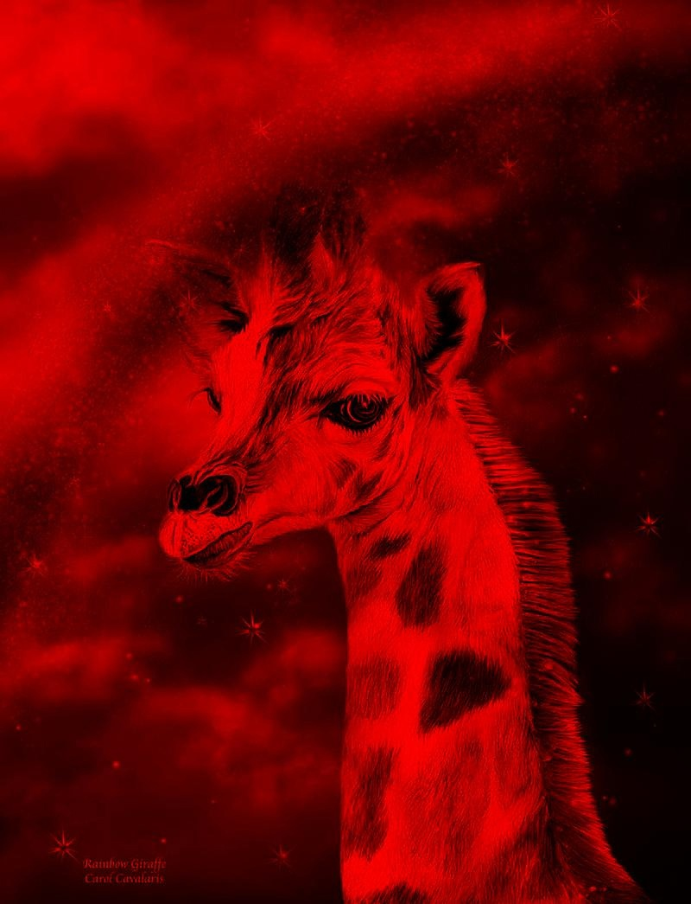

Лабораторная работа 2. Переход между цветовыми пространствами. Линейный и нелинейный переход. Мера цветовой разницы. Функции преобразования яркости. Гамма, логарифмическое, экспоненциаяльное кодирование.

Отобразить изображение по каналам RGB (каждый канал представить как градации серого).


Оригинал                                |  
:--------------------------------------:|
 |  

```
public void channels(BufferedImage img) throws IOException {
    int h = img.getHeight();
    int w = img.getWidth();
    BufferedImage chR = new BufferedImage(w, h, TYPE_INT_RGB);
    BufferedImage chG = new BufferedImage(w, h, TYPE_INT_RGB);
    BufferedImage chB = new BufferedImage(w, h, TYPE_INT_RGB);
    for (int y = 0; y < h; y++) {
        for (int x = 0; x < w; x++) {
            int rgb = img.getRGB(x, y);
            int red = red(rgb);
            int green = green(rgb);
            int blue = blue(rgb);
            chR.setRGB(x, y, rgb(red, red, red));
            chG.setRGB(x, y, rgb(green, green, green));
            chB.setRGB(x, y, rgb(blue, blue, blue));
        }
    }
    save(chR, "result/channels", "r", FORMAT);
    save(chG, "result/channels", "g", FORMAT);
    save(chB, "result/channels", "b", FORMAT);
}
```


Отображение по каналам R                  | Отображение по каналам G                | Отображение по каналам B               | Оригинал               | 
:----------------------------------------:|:---------------------------------------:|:--------------------------------------:|:--------------------------------------:|
     |    |   |   |
 
 Лианеризовать изображение обратным гамма преобразованием.
 
 ```
public BufferedImage gammaCorrection(BufferedImage img, double gamma) throws IOException {
    int h = img.getHeight();
    int w = img.getWidth();
    BufferedImage result = new BufferedImage(w, h, TYPE_INT_RGB);
    int[] gammaLUT = new int[256];
    for (int i = 0; i < gammaLUT.length; i++) {
        gammaLUT[i] = (int) (255 * (Math.pow(i / 255f, 1 / gamma)));
    }
    for (int y = 0; y < h; y++) {
        for (int x = 0; x < w; x++) {
            int rgb = img.getRGB(x, y);
            int red = gammaLUT[red(rgb)];
            int green = gammaLUT[green(rgb)];
            int blue = gammaLUT[blue(rgb)];
            result.setRGB(x, y, rgb(red, green, blue));
        }
    }
    save(result, "result/gammaCor", "result", FORMAT);
    return result;
}
```

Отображение по каналам R                  | Оригинал                                 |
:----------------------------------------:|:----------------------------------------:|
        |        |  

Отобразить по каналам RGB.
```
public void rgbChannels(BufferedImage img) throws IOException {
    int h = img.getHeight();
    int w = img.getWidth();
    BufferedImage chR = new BufferedImage(w, h, TYPE_INT_RGB);
    BufferedImage chG = new BufferedImage(w, h, TYPE_INT_RGB);
    BufferedImage chB = new BufferedImage(w, h, TYPE_INT_RGB);
    for (int y = 0; y < h; y++) {
        for (int x = 0; x < w; x++) {
            int rgb = img.getRGB(x, y);
            int red = red(rgb);
            int green = green(rgb);
            int blue = blue(rgb);
            chR.setRGB(x, y, rgb(red, 0, 0));
            chG.setRGB(x, y, rgb(0, green, 0));
            chB.setRGB(x, y, rgb(0, 0, blue));
        }
    }
    save(chR, "result/rgbChannels", "r", FORMAT);
    save(chG, "result/rgbChannels", "g", FORMAT);
    save(chB, "result/rgbChannels", "b", FORMAT);
}
```


Отображение по каналам R                  | Отображение по каналам G                | Отображение по каналам B               | Оригинал               | 
:----------------------------------------:|:---------------------------------------:|:--------------------------------------:|:--------------------------------------:|
     |    |   |   |
 
5. Построить проекцию цветов исходного изображения на цветовой локус (плоскость xy).
```
public void loscut(BufferedImage img) throws IOException {
        int size = 1000;
        int xMove = (int) Math.round(0.312 * size) / 2;
        int yMove = (int) Math.round(0.329 * size) / 2;
        BufferedImage loscut = new BufferedImage(size, size, TYPE_INT_RGB);
        for (int i = 0; i < img.getHeight(); i++) {
            for (int j = 0; j < img.getWidth(); j++) {
                int rgb = img.getRGB(j, i);
                int[] xyz = RGBtoXYZ(ch1(rgb), ch2(rgb), ch3(rgb));
                double sum = xyz[0] + xyz[1] + xyz[2];
                if (sum > 0) {
                    double nx = xyz[0] / sum;
                    double ny = xyz[1] / sum;
                    double nz = xyz[2] / sum;
                    int x = (int) Math.round((1 - ny - nz) * size) + xMove;
                    int y = (int) Math.round((1 - nx - nz) * size * -1) + size - yMove;
                    try {
                        loscut.setRGB(x, y, rgb);
                    } catch (ArrayIndexOutOfBoundsException e) {
                        System.out.println("x: " + x + "; y: " + (size - y));
                    }
                }
            }
        }
        save(loscut, "result/loscut", "result", FORMAT);
    }
```
Отображение по каналам R                  | Оригинал                                 |
:----------------------------------------:|:----------------------------------------:|
        |       


