# Лабораторная работа 2. Переход между цветовыми пространствами. Линейный и нелинейный переход. Мера цветовой разницы. Функции преобразования яркости. Гамма, логарифмическое, экспоненциаяльное кодирование.

## Отображение изображения по каналам RGB (каждый канал представлен как градации серого).


Оригинал                                |  
:--------------------------------------:|
 |  

```
public void channels(BufferedImage img) throws IOException {
    int h = img.getHeight();
    int w = img.getWidth();
    BufferedImage chR = new BufferedImage(w, h, TYPE_INT_RGB);
    BufferedImage chG = new BufferedImage(w, h, TYPE_INT_RGB);
    BufferedImage chB = new BufferedImage(w, h, TYPE_INT_RGB);
    for (int y = 0; y < h; y++) {
        for (int x = 0; x < w; x++) {
            int rgb = img.getRGB(x, y);
            int red = red(rgb);
            int green = green(rgb);
            int blue = blue(rgb);
            chR.setRGB(x, y, rgb(red, red, red));
            chG.setRGB(x, y, rgb(green, green, green));
            chB.setRGB(x, y, rgb(blue, blue, blue));
        }
    }
    save(chR, "result/channels", "r", FORMAT);
    save(chG, "result/channels", "g", FORMAT);
    save(chB, "result/channels", "b", FORMAT);
}
```

```
import numpy as np
import matplotlib.pyplot as plt
import cv2
from PIL import Image

img_name = "original.jpg"
img = cv2.imread(img_name)

b, g, r = cv2.split(img)

image1=Image.fromarray(b.astype('uint8')).convert('RGB')
image1.save('originalB.jpg')

image2=Image.fromarray(g.astype('uint8')).convert('RGB')
image2.save('originalG.jpg')

image3=Image.fromarray(r.astype('uint8')).convert('RGB')
image3.save('originalR.jpg')
```


Отображение по каналам R                  | Отображение по каналам G                | Отображение по каналам B               | Оригинал               | 
:----------------------------------------:|:---------------------------------------:|:--------------------------------------:|:--------------------------------------:|
     |    |   |   |
 
 
 Отображение по каналам R                 | Отображение по каналам G                | Отображение по каналам B               | Оригинал               | 
:----------------------------------------:|:---------------------------------------:|:--------------------------------------:|:--------------------------------------:|
    |   |  |   |
 
 
## Лианеризование изображения обратным гамма преобразованием.
 
 ```
public BufferedImage gammaCorrection(BufferedImage img, double gamma) throws IOException {
    int h = img.getHeight();
    int w = img.getWidth();
    BufferedImage result = new BufferedImage(w, h, TYPE_INT_RGB);
    int[] gammaLUT = new int[256];
    for (int i = 0; i < gammaLUT.length; i++) {
        gammaLUT[i] = (int) (255 * (Math.pow(i / 255f, 1 / gamma)));
    }
    for (int y = 0; y < h; y++) {
        for (int x = 0; x < w; x++) {
            int rgb = img.getRGB(x, y);
            int red = gammaLUT[red(rgb)];
            int green = gammaLUT[green(rgb)];
            int blue = gammaLUT[blue(rgb)];
            result.setRGB(x, y, rgb(red, green, blue));
        }
    }
    save(result, "result/gammaCor", "result", FORMAT);
    return result;
}
```

Лианезированное гамма преобразованием                 | Оригинал                                 |
:----------------------------------------:|:----------------------------------------:|
        |        |  

## Отображение по каналам RGB.
```
public void rgbChannels(BufferedImage img) throws IOException {
    int h = img.getHeight();
    int w = img.getWidth();
    BufferedImage chR = new BufferedImage(w, h, TYPE_INT_RGB);
    BufferedImage chG = new BufferedImage(w, h, TYPE_INT_RGB);
    BufferedImage chB = new BufferedImage(w, h, TYPE_INT_RGB);
    for (int y = 0; y < h; y++) {
        for (int x = 0; x < w; x++) {
            int rgb = img.getRGB(x, y);
            int red = red(rgb);
            int green = green(rgb);
            int blue = blue(rgb);
            chR.setRGB(x, y, rgb(red, 0, 0));
            chG.setRGB(x, y, rgb(0, green, 0));
            chB.setRGB(x, y, rgb(0, 0, blue));
        }
    }
    save(chR, "result/rgbChannels", "r", FORMAT);
    save(chG, "result/rgbChannels", "g", FORMAT);
    save(chB, "result/rgbChannels", "b", FORMAT);
}
```


Отображение по каналам R                  | Отображение по каналам G                | Отображение по каналам B               | Оригинал               | 
:----------------------------------------:|:---------------------------------------:|:--------------------------------------:|:--------------------------------------:|
     |    |   |   |
 
 
 Отображение по каналам R                 | Отображение по каналам G                | Отображение по каналам B               | Оригинал               | 
:----------------------------------------:|:---------------------------------------:|:--------------------------------------:|:--------------------------------------:|
 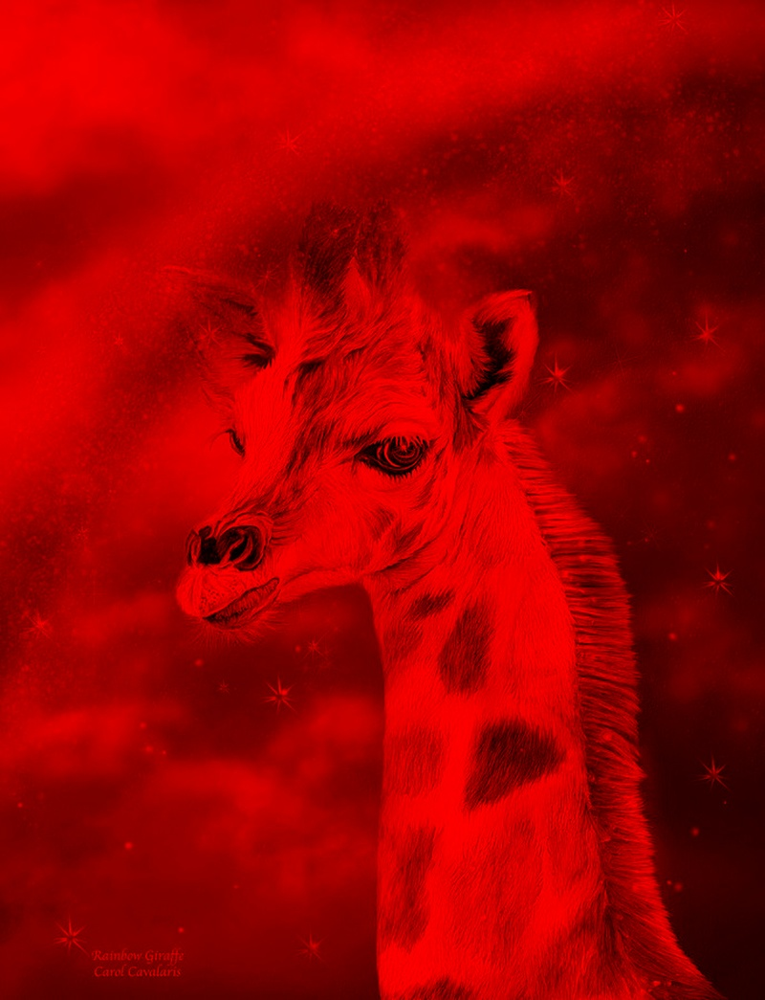  |  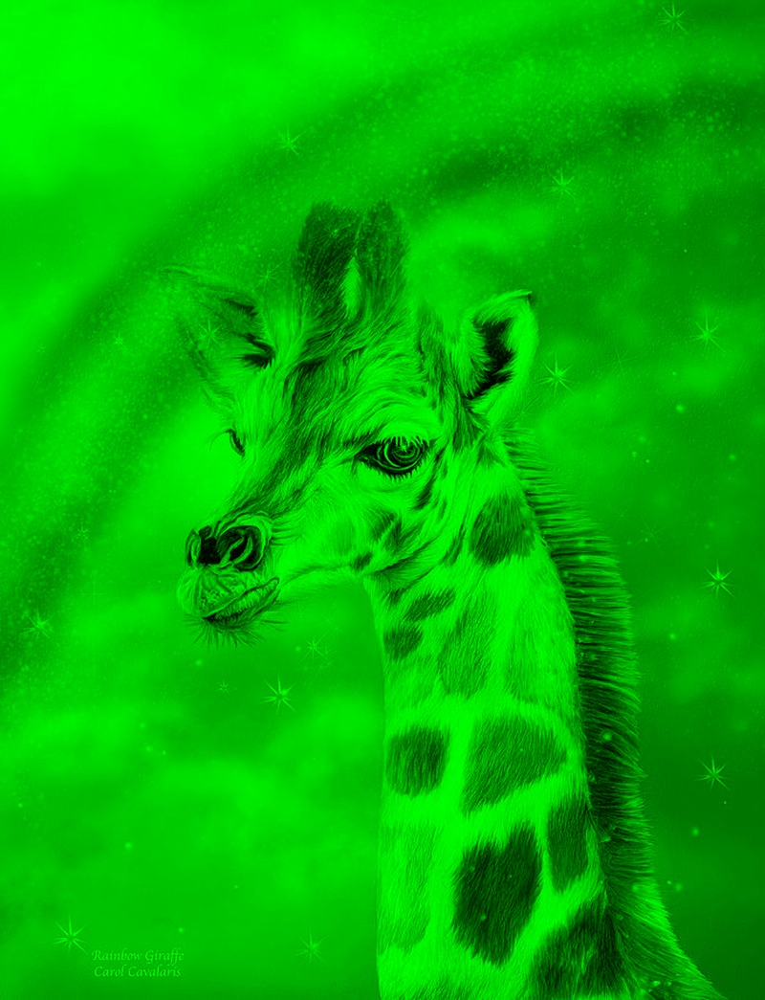|  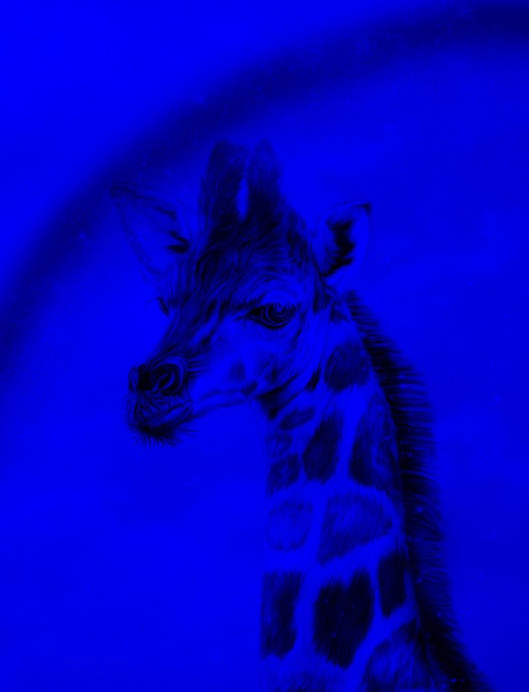 |   |
 
 
## Отображение поканально разницы между исходным изображением и линеаризованным.
```
private void difference(BufferedImage img, BufferedImage gCor) throws IOException {
    int h = img.getHeight();
    int w = img.getWidth();
    BufferedImage chR = new BufferedImage(w, h, TYPE_INT_RGB);
    BufferedImage chG = new BufferedImage(w, h, TYPE_INT_RGB);
    BufferedImage chB = new BufferedImage(w, h, TYPE_INT_RGB);
    for (int y = 0; y < h; y++) {
        for (int x = 0; x < w; x++) {
            int orig = img.getRGB(x, y);
            int corr = gCor.getRGB(x, y);
            int red = red(orig) - red(corr);
            int green = green(orig) - green(corr);
            int blue = blue(orig) - blue(corr);
            chR.setRGB(x, y, rgb(red, 0, 0));
            chG.setRGB(x, y, rgb(0, green, 0));
            chB.setRGB(x, y, rgb(0, 0, blue));
        }
    }
    save(chR, "result/difference", "r", FORMAT);
    save(chG, "result/difference", "g", FORMAT);
    save(chB, "result/difference", "b", FORMAT);
}
```
Разница по каналу R                 | Разница по каналу G              | Разница по каналу В               | 
:----------------------------------------:|:---------------------------------------:|:--------------------------------------:|
 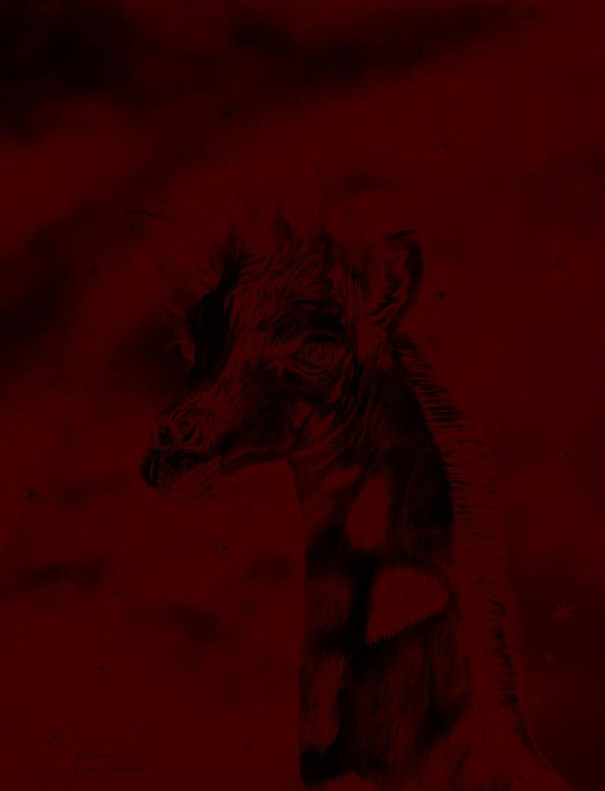  |  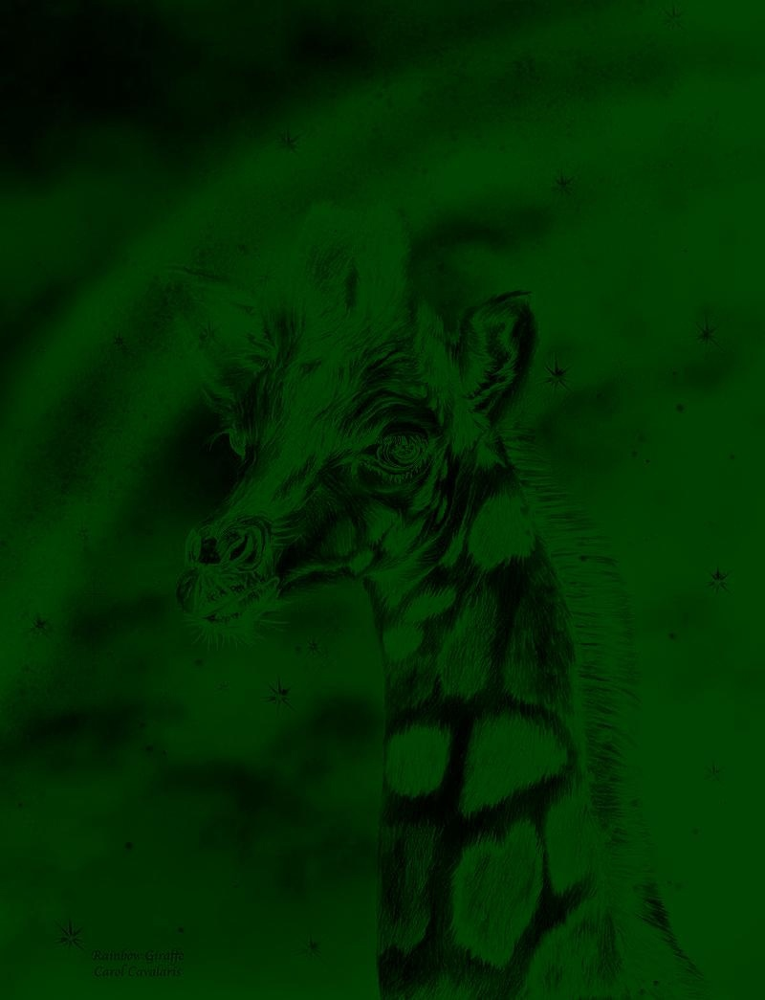|  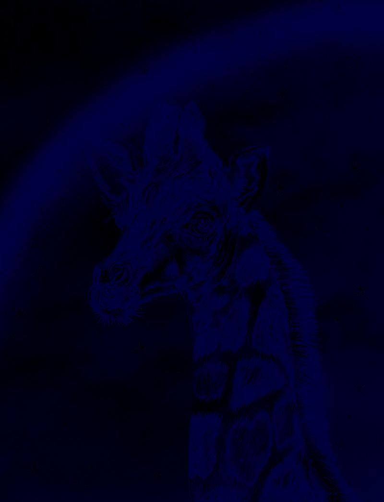 |   |

 
 
##  Построение проекции цветов исходного изображения на цветовой локус (плоскость xy).
```
public void loscut(BufferedImage img) throws IOException {
        int size = 1000;
        int xMove = (int) Math.round(0.312 * size) / 2;
        int yMove = (int) Math.round(0.329 * size) / 2;
        BufferedImage loscut = new BufferedImage(size, size, TYPE_INT_RGB);
        for (int i = 0; i < img.getHeight(); i++) {
            for (int j = 0; j < img.getWidth(); j++) {
                int rgb = img.getRGB(j, i);
                int[] xyz = RGBtoXYZ(ch1(rgb), ch2(rgb), ch3(rgb));
                double sum = xyz[0] + xyz[1] + xyz[2];
                if (sum > 0) {
                    double nx = xyz[0] / sum;
                    double ny = xyz[1] / sum;
                    double nz = xyz[2] / sum;
                    int x = (int) Math.round((1 - ny - nz) * size) + xMove;
                    int y = (int) Math.round((1 - nx - nz) * size * -1) + size - yMove;
                    try {
                        loscut.setRGB(x, y, rgb);
                    } catch (ArrayIndexOutOfBoundsException e) {
                        System.out.println("x: " + x + "; y: " + (size - y));
                    }
                }
            }
        }
        save(loscut, "result/loscut", "result", FORMAT);
    }
```
Локуст                  | Оригинал                                 |
:----------------------------------------:|:----------------------------------------:|
        |       


## Функция перевода цветов из линейного RGB в XYZ с использованием матрицы. Сравнение результатов через построение разностного изоборажения.

```
public BufferedImage RGBtoXYZ(BufferedImage img) throws IOException {
        //opencv
        Mat xyzMat = new Mat();
        Imgproc.cvtColor(img2Mat(img), xyzMat, Imgproc.COLOR_BGR2XYZ);
        BufferedImage resultL = (BufferedImage) HighGui.toBufferedImage(xyzMat);

        int h = img.getHeight();
        int w = img.getWidth();
        BufferedImage result = new BufferedImage(w, h, TYPE_INT_RGB);
        for (int i = 0; i < h; i++) {
            for (int j = 0; j < w; j++) {
                int rgb = img.getRGB(j, i);
                int[] xyz = RGBtoXYZ(ch1(rgb), ch2(rgb), ch3(rgb));
                result.setRGB(j, i, color(xyz[2], xyz[1], xyz[0]));
            }
        }
        save(result, "result/RGBtoXYZ", "result", FORMAT);
        save(resultL, "result/RGBtoXYZ", "resultLib", FORMAT);
        save(diff(result, resultL), "result/RGBtoXYZ", "diff", FORMAT);
        return result;
    }
        private static int[] RGBtoXYZ(double r, double g, double b) {
        return new int[]{
                (int) Math.round(r * 0.412453 + g * 0.357580 + b * 0.180423),
                (int) Math.round(r * 0.212671 + g * 0.715160 + b * 0.072169),
                (int) Math.round(r * 0.019334 + g * 0.119193 + b * 0.950227)
        };
    }
    
    private static BufferedImage diff(BufferedImage imgA, BufferedImage imgB) {
        int h = imgA.getHeight();
        int w = imgA.getWidth();
        BufferedImage result = new BufferedImage(w, h, TYPE_INT_RGB);
        for (int i = 0; i < h; i++) {
            for (int j = 0; j < w; j++) {
                int colorA = imgA.getRGB(j, i);
                int colorB = imgB.getRGB(j, i);
                int r = ch1(colorA) - ch1(colorB);
                int g = ch2(colorA) - ch2(colorB);
                int b = ch3(colorA) - ch3(colorB);
                if (r < 0) r = 0;
                else if (r > 255) r = 255;
                if (g < 0) g = 0;
                else if (g > 255) g = 255;
                if (b < 0) b = 0;
                else if (b > 255) b = 255;
                result.setRGB(j, i, color(r, g, b));
            }
        }
        return result;
    }
```
Ручное RGB в XYZ        | Библиотека             |Разница               | 
:----------------------------------------:|:---------------------------------------:|:--------------------------------------:|
   |  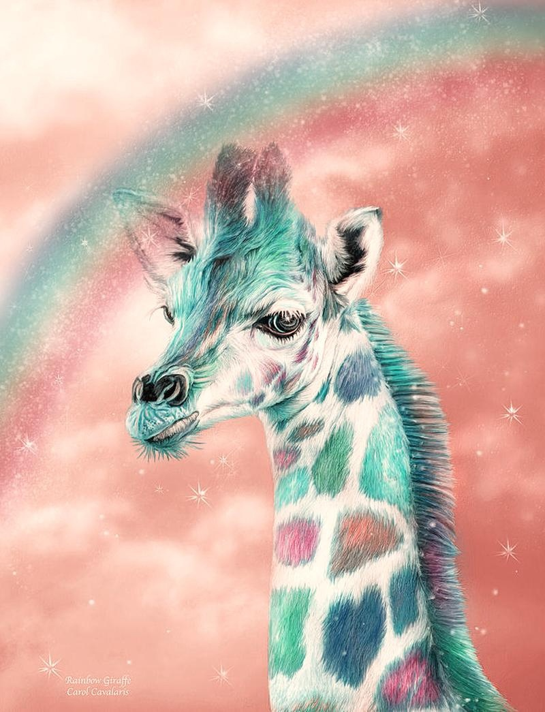|   |   |


## Функция перевода цветов из XYZ в RGB (построить обратную матрицу XYZ в RGB). Преобразование изображения XYZ в линейный RGB. Применение гамма преобразования. Сравнение результатов через построение разностного изоборажения.

```
public BufferedImage XYZtoRGB(BufferedImage img) throws IOException {
        //opencv
        Mat rgbMat = new Mat();
        Imgproc.cvtColor(img2Mat(img), rgbMat, Imgproc.COLOR_XYZ2BGR);
        BufferedImage resultL = (BufferedImage) HighGui.toBufferedImage(rgbMat);

        int h = img.getHeight();
        int w = img.getWidth();
        BufferedImage result = new BufferedImage(w, h, TYPE_INT_RGB);
        for (int i = 0; i < h; i++) {
            for (int j = 0; j < w; j++) {
                int xyz = img.getRGB(j, i);
                //int rgb = gammaCorrection(XYZtoRGB(ch3(xyz), ch2(xyz), ch1(xyz)), 2.4);
                int rgb = XYZtoRGB(ch3(xyz), ch2(xyz), ch1(xyz));
                result.setRGB(j, i, rgb);
            }
        }
        save(result, "result/XYZtoRGB", "result", FORMAT);
        save(resultL, "result/XYZtoRGB", "resultLib", FORMAT);
        save(diff(result, resultL), "result/XYZtoRGB", "diff", FORMAT);
        return result;
    }
        private static int XYZtoRGB(int x, int y, int z) {
        double r = x * 3.240479 + y * -1.537150 + z * -0.498535;
        double g = x * -0.969256 + y * 1.875991 + z * 0.041556;
        double b = x * 0.055648 + y * -0.204043 + z * 1.057311;
        return color(r, g, b);
    }
```
Ручное XYZ в RGB               | Библиотека             |Разница               | 
:----------------------------------------:|:---------------------------------------:|:--------------------------------------:|
 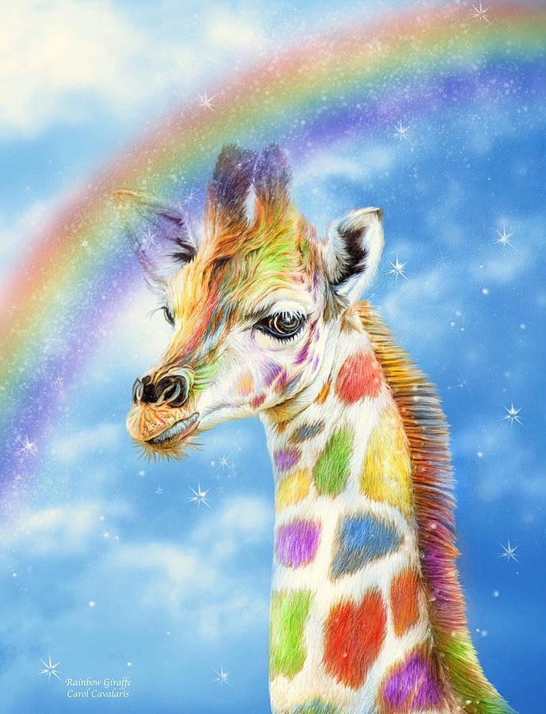  |  |  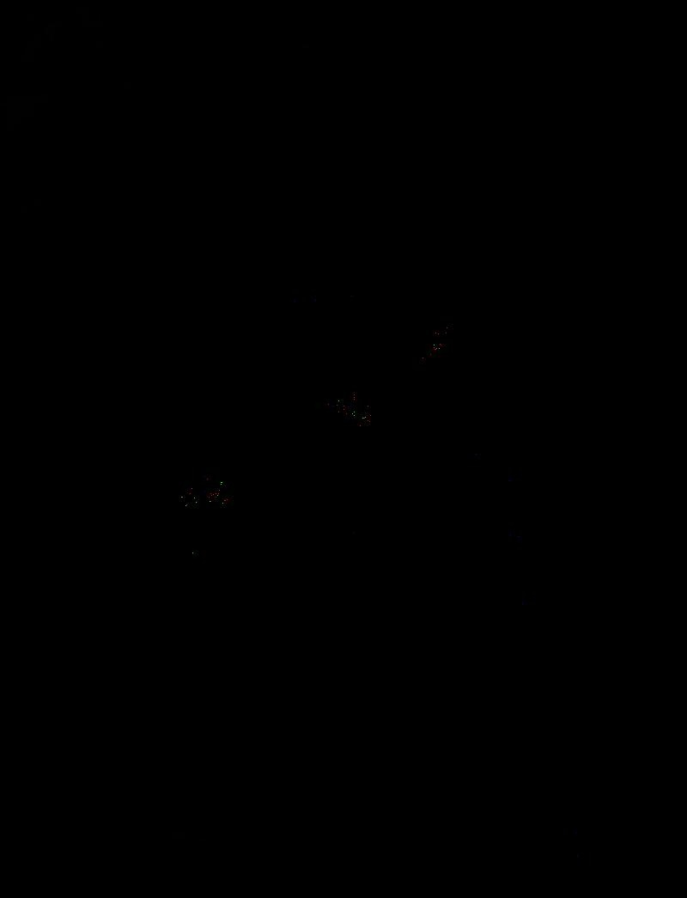 |   |
 
 
## Функция перевода цветов из линейного RGB в HSV и обратно. Сравнение результатов через построение разностного изоборажения.
 
 ```
 private static double[] RGBtoHSV(int r, int g, int b) {
        List<Integer> arr = Arrays.asList(r, g, b);
        double min = Collections.min(arr);
        double v = Collections.max(arr);
        double s;
        if (v == 0) {
            s = 0;
        } else {
            s = 1 - min / v;
        }
        double h = 0;
        if (v == r) {
            h = 60 * (g - b) / (v - min);
        } else if (v == g) {
            h = 60 * (b - r) / (v - min) + 120;
        } else if (v == b) {
            h = 60 * (r - g) / (v - min) + 240;
        }
        if (h < 0) h += 360;
        return new double[]{h / 2, s * 255, v};
    }
    
 public static int HSVtoRGB(float H, float S, float V) {
        float R, G, B;
        H /= 180f;
        S /= 255f;
        V /= 255f;
        if (S == 0) {
            R = V * 255;
            G = V * 255;
            B = V * 255;
        } else {
            float var_h = H * 6;
            if (var_h == 6) {
                var_h = 0;
            }
            int var_i = (int) Math.floor(var_h);
            float var_1 = V * (1 - S);
            float var_2 = V * (1 - S * (var_h - var_i));
            float var_3 = V * (1 - S * (1 - (var_h - var_i)));
            float var_r;
            float var_g;
            float var_b;
            if (var_i == 0) {
                var_r = V;
                var_g = var_3;
                var_b = var_1;
            } else if (var_i == 1) {
                var_r = var_2;
                var_g = V;
                var_b = var_1;
            } else if (var_i == 2) {
                var_r = var_1;
                var_g = V;
                var_b = var_3;
            } else if (var_i == 3) {
                var_r = var_1;
                var_g = var_2;
                var_b = V;
            } else if (var_i == 4) {
                var_r = var_3;
                var_g = var_1;
                var_b = V;
            } else {
                var_r = V;
                var_g = var_1;
                var_b = var_2;
            }
            R = var_r * 255;
            G = var_g * 255;
            B = var_b * 255;
        }
        return color(R, G, B);
    }
 ```
 
 Ручное RGB->HSV              | Библиотека RGB->HSV             |Разница RGB->HSV               | 
:----------------------------------------:|:---------------------------------------:|:--------------------------------------:|
 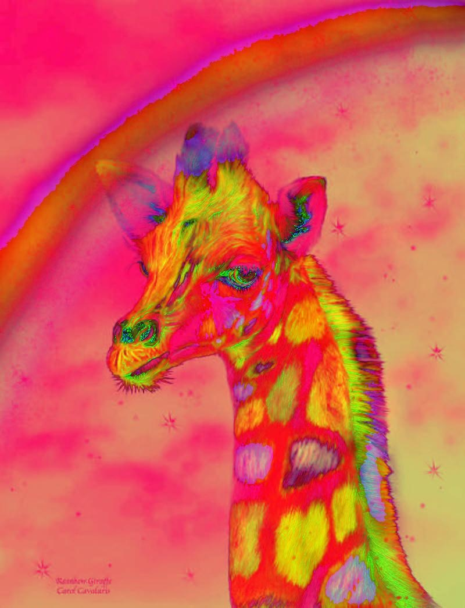  |  |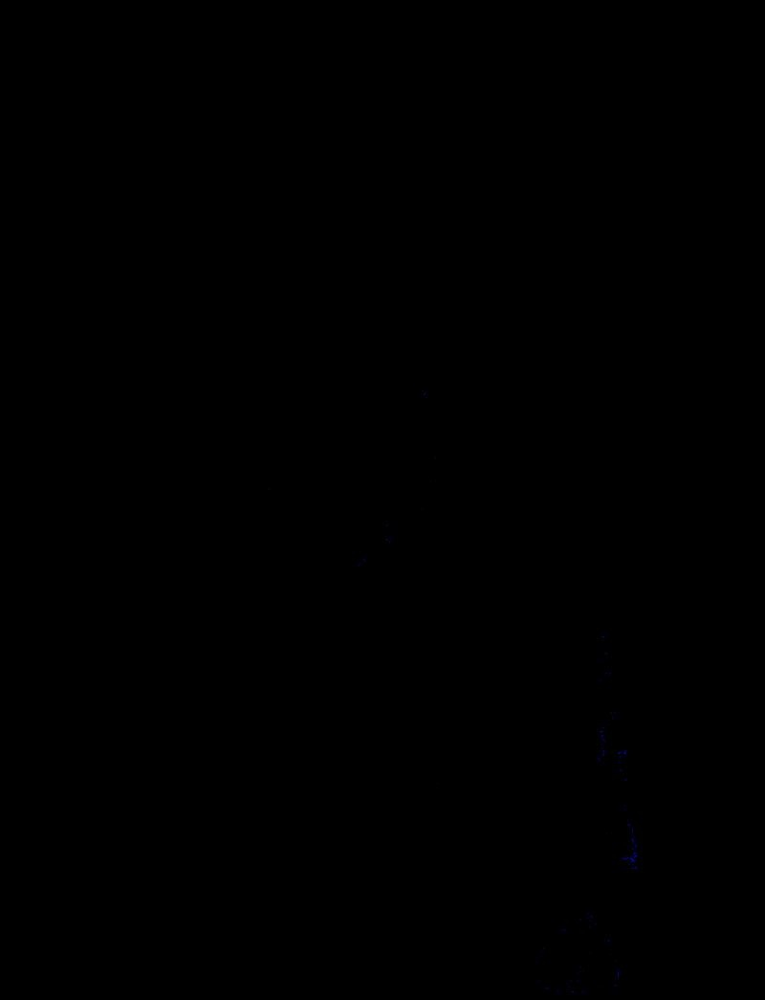 |   |
 
 
 Ручное HSV->RGB            | Библиотека HSV->RGB             |Разница HSV->RGB               | 
:----------------------------------------:|:---------------------------------------:|:--------------------------------------:|
   |  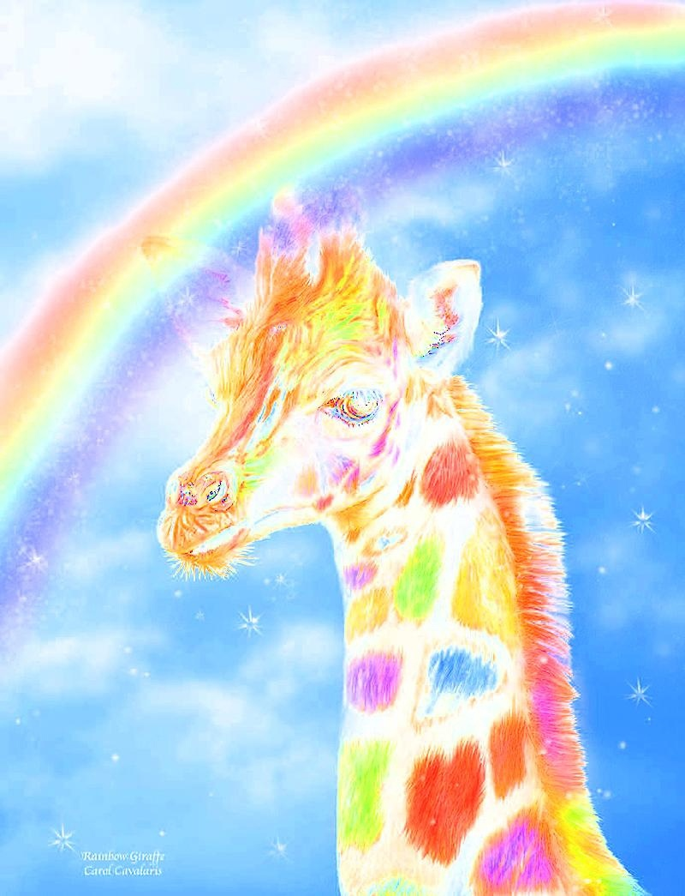|  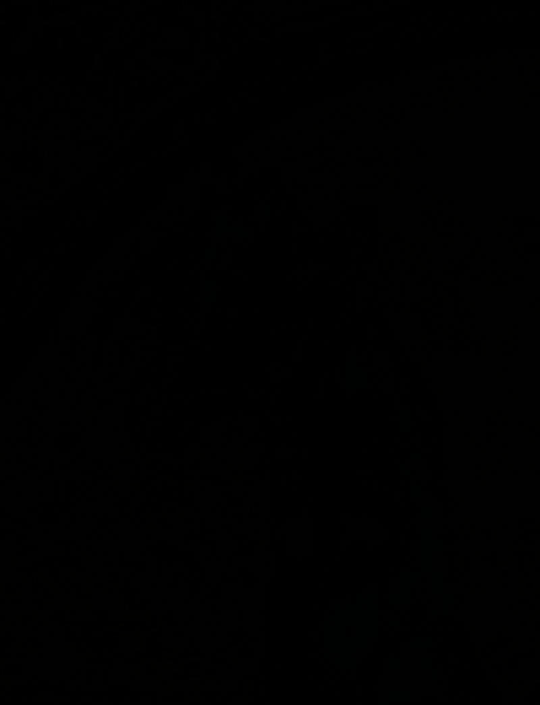 |   |
 
 
 
 
