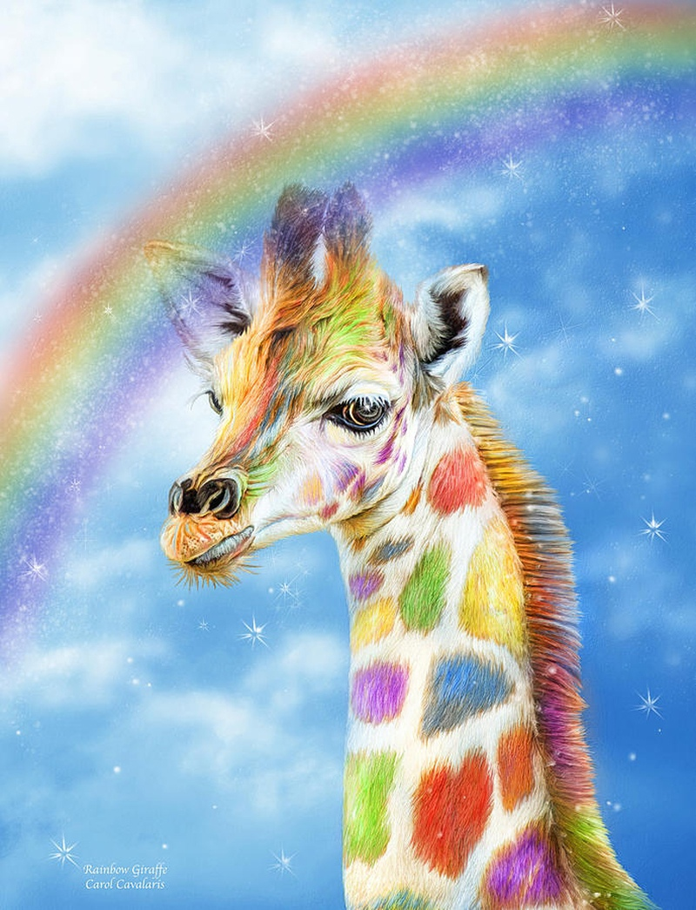
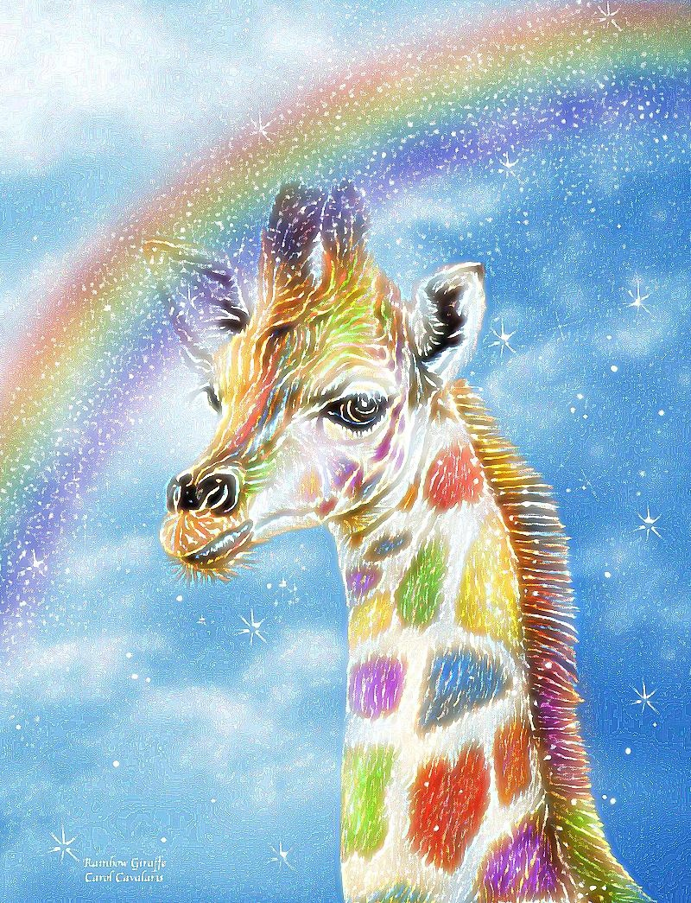

## Лабораторная работа 4. Повышение резкости изображений.


 Применить к исходному изображению Гауссово размытие
 
   ```
  import java.awt.image.BufferedImage;

public class GaussianBlur {
    private int radius = 6;
    private BlurType blurType = BlurType.BOTH;
    private int[] kernel;
    private int kernelSum;
    private int[][] multable;

    public GaussianBlur() {
        preCalculate();
    }

    public GaussianBlur(int radius, BlurType blurType) {
        this.radius = radius;
        this.blurType = blurType;
        preCalculate();
    }

    private void preCalculate() {
        int sz = radius * 2 + 1;
        kernel = new int[sz];
        multable = new int[sz][256];
        for (int i = 1; i <= radius; i++) {
            int szi = radius - i;
            int szj = radius + i;
            kernel[szj] = kernel[szi] = (szi + 1) * (szi + 1);
            kernelSum += (kernel[szj] + kernel[szi]);
            for (int j = 0; j < 256; j++) {
                multable[szj][j] = multable[szi][j] = kernel[szj] * j;
            }
        }
        kernel[radius] = (radius + 1) * (radius + 1);
        kernelSum += kernel[radius];
        for (int j = 0; j < 256; j++) {
            multable[radius][j] = kernel[radius] * j;
        }
    }

    public BufferedImage process(BufferedImage img) {
        int width = img.getWidth();
        int height = img.getHeight();
        int pixelCount = width * height;
        BufferedImage result = new BufferedImage(width, height, BufferedImage.TYPE_INT_RGB);

        int[] r = new int[pixelCount];
        int[] g = new int[pixelCount];
        int[] b = new int[pixelCount];

        int[] r2 = new int[pixelCount];
        int[] g2 = new int[pixelCount];
        int[] b2 = new int[pixelCount];

        for (int i = 0; i < height; i++) {
            for (int j = 0; j < width; j++) {
                int color = img.getRGB(j, i);
                int index = width * i + j;
                r[index] = Main.ch1(color);
                g[index] = Main.ch2(color);
                b[index] = Main.ch3(color);
            }
        }

        if (blurType != BlurType.VERTICAL) {
            for (int i = 0; i < height; i++) {
                for (int j = 0; j < width; j++) {
                    int index = width * i + j;
                    int start = width * i;
                    int rsum = 0;
                    int gsum = 0;
                    int bsum = 0;
                    int sum = 0;
                    int read = index - radius;

                    for (int z = 0; z < kernel.length; z++) {
                        if (read >= start && read < start + width) {
                            rsum += multable[z][r[read]];
                            gsum += multable[z][g[read]];
                            bsum += multable[z][b[read]];
                            sum += kernel[z];
                        }
                        ++read;
                    }

                    r2[index] = (rsum / sum);
                    g2[index] = (gsum / sum);
                    b2[index] = (bsum / sum);

                    if (blurType == BlurType.HORIZONTAL) {
                        result.setRGB(j, i, Main.color(rsum / sum, gsum / sum, bsum / sum));
                    }

                    ++index;
                }
            }
        }
        if (blurType == BlurType.HORIZONTAL) {
            return result;
        }
//размытие по одному из указанных направлений
        for (int i = 0; i < height; i++) {
            int y = i - radius;
            for (int j = 0; j < width; j++) {
                int rsum = 0;
                int gsum = 0;
                int bsum = 0;
                int sum = 0;
                int read = y * width + j;
                int tempy = y;
                for (int z = 0; z < kernel.length; z++) {
                    if (tempy >= 0 && tempy < height) {
                        if (blurType == BlurType.VERTICAL) {
                            rsum += multable[z][r[read]];
                            gsum += multable[z][g[read]];
                            bsum += multable[z][b[read]];
                        } else {
                            rsum += multable[z][r2[read]];
                            gsum += multable[z][g2[read]];
                            bsum += multable[z][b2[read]];
                        }
                        sum += kernel[z];
                    }
                    read += width;
                    ++tempy;
                }
                result.setRGB(j, i, Main.color(rsum / sum, gsum / sum, bsum / sum));
            }
        }
        return result;
    }
}
                                                     
```
Гауссово размытие                       | Оригинал                                 |  
:--------------------------------------:|:----------------------------------------:|
      |        |
 
4. Реализовать функцию повышения резкости методом усиления границ.
5. Применить построенную функцию к размытому изображению. Вывести результат работы функции вместе с исходным изображением.
  Данная функция применяет Гауссово размытие повторно и вычитает результат из оригинального изображения. Таким образом получается "маска" с усиленными границами, которая прибавляется к исходному изображение. 
  
```
  public BufferedImage sharp(BufferedImage img, int repeat) throws IOException {
      BufferedImage result = new BufferedImage(img.getWidth(), img.getHeight(), TYPE_INT_RGB);
      GaussianBlur blur = new GaussianBlur();
      for (int i = 0; i < repeat; i++) {
          result = sum(img, diff(img, blur.process(img)));
          img.setData(result.getData());
          save(result, "result/sharp", "result" + i, FORMAT);
      }
      return result;
  }
      
                                 
```
Ручное               | Библиотека             |Разница               | 
:----------------------------------------:|:---------------------------------------:|:--------------------------------------:|
   |  |   |   |
 
6. Используя две любые функции повышающие резкость изображения, обработать размытое изображение. Результаты также вывести вместе с исходным изображением для сравнения.
  * Первая функция 
  
   Здесь используется размытие по Гауссу, но вычитание размытой версии из исходного изображения происходит взвешенным образом.
  
```
  private void sharpLib1(BufferedImage img) throws IOException {
      Mat blurred = new Mat();
      Imgproc.GaussianBlur(img2Mat(img), blurred, new Size(0, 0), 3);
      Mat weighted = blurred.clone();
      Core.addWeighted(blurred, 1.5, weighted, -0.5, 0, weighted);
      BufferedImage result = (BufferedImage) HighGui.toBufferedImage(weighted);
      save(result, "result/sharpLib1", "result", FORMAT);
  }
  
```
  
Результат размытия                       | Оригинал                                 |  
:--------------------------------------:|:----------------------------------------:|
      |        |
  
  * Вторая функция 
  
  В этом способе повышения резкости ипользуется функция 2D-фильтрации и сверточная матрица, часто называемая ядром. 

```
  
  private void sharpLib2(BufferedImage img) throws IOException {
      Mat kernel = new Mat(3, 3, CvType.CV_16SC1);
      kernel.put(0, 0, 0, -1, 0, -1, 5, -1, 0, -1, 0);
      Mat sharped = new Mat();
      Imgproc.filter2D(img2Mat(img), sharped, -1, kernel);
      BufferedImage result = (BufferedImage) HighGui.toBufferedImage(sharped);
      save(result, "result/sharpLib2", "result", FORMAT);
  }
  
```
  
Результат размытия                       | Оригинал                                 |  
:--------------------------------------:|:----------------------------------------:|
      |        |
 
 
 
