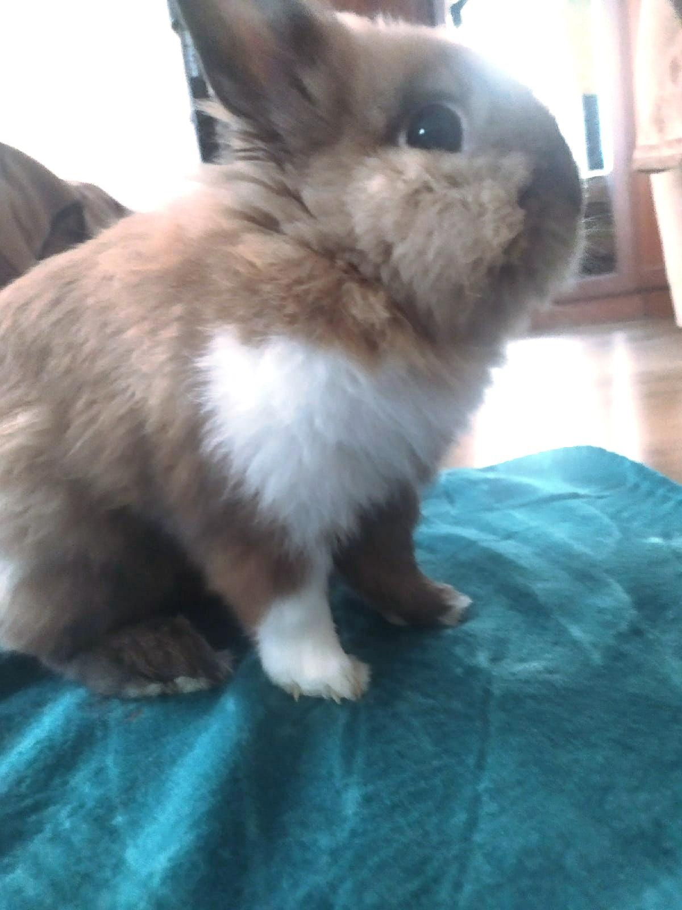
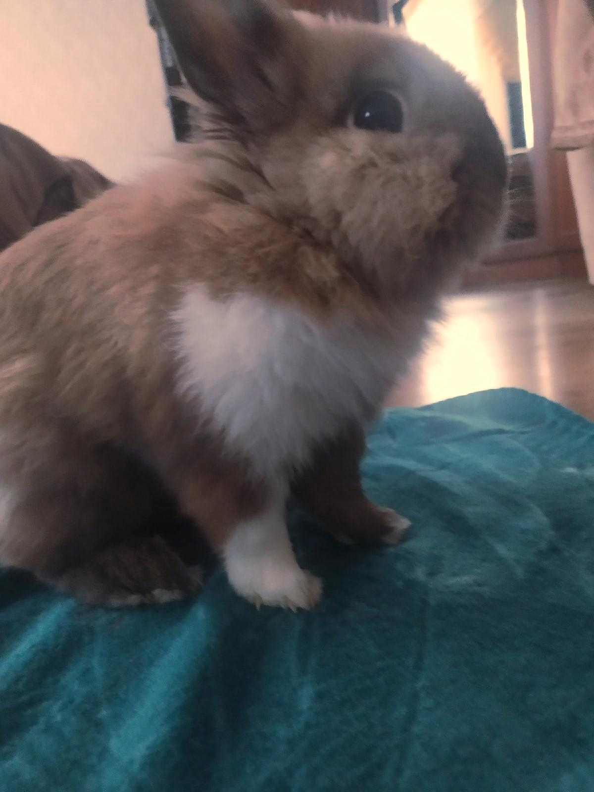
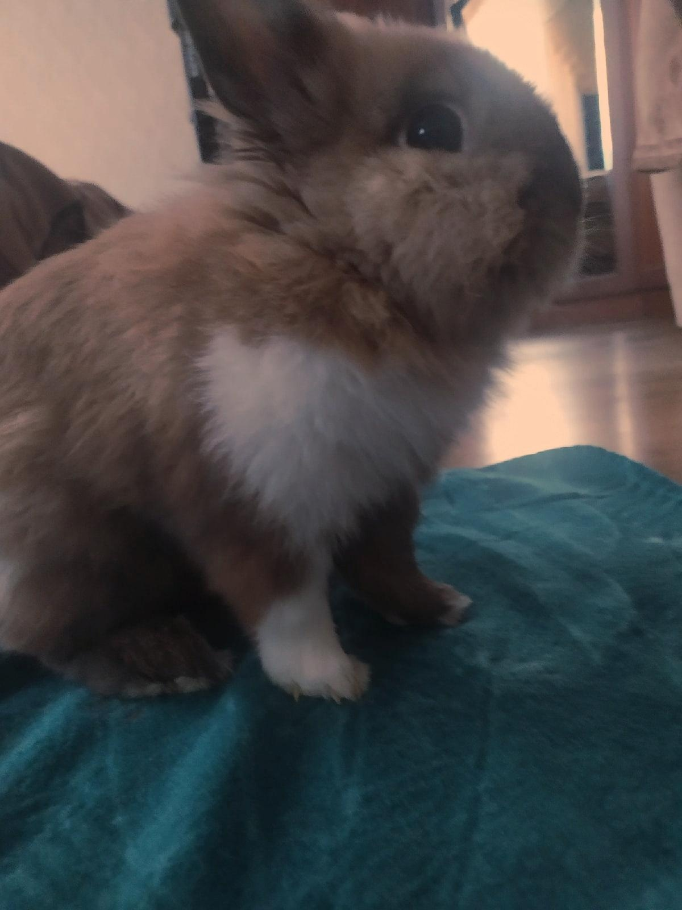
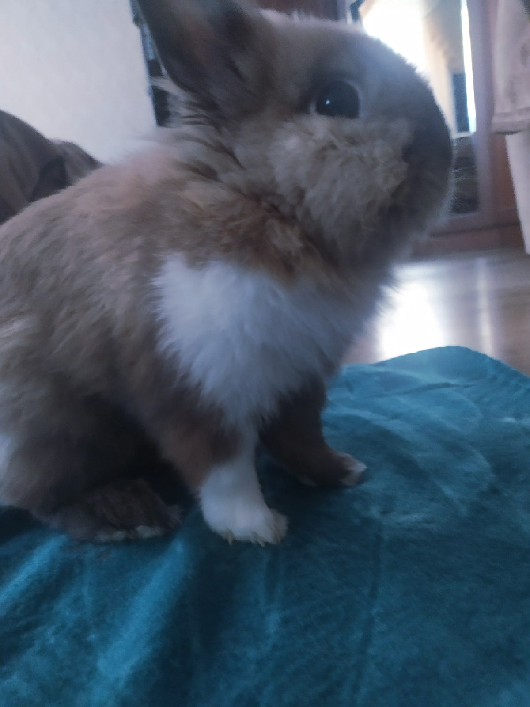

Лабораторная работа 5. Баланс белого.
План работ:

Скачать цветное изображение по выбору с нарушенным цветовым балансом (желательно, чтобы на изображении был объект предположительно белого цвета).

Изображение с нарушенным балансом цветов (лапа не белая)                          |  
:--------------------------------------:|
 |  
 

Определить вручную цвет объекта, построить преобразование (матрицу 3х3) для коррекции белого. Применить к изображению. Не забудьте про нормировку яркости (если она будет нужна).

Определение цвета                          |  
:--------------------------------------:|
 |  
 
 
Исходное изображение скорректировать согласно теории Серого мира вручную.

Исходное изображение скорректировать согласно теории Серого мира при помощи библиотечной функции.

Опционально: найти библиотечную реализацию метода Ретинекс и применить подход к исходному изображению.
Все результаты вывести на экран рядом для визуального сравнения.

Результат помощью матрицы | Результат (теория Серого мира вручную)    |  Результат (теория Серого мира библиотека)      | Оригинал
:----------------------------------------:|:---------------------------------------:|:--------------------------------------:|:--------------------------------------:|
     |    |   |   |
 
 
