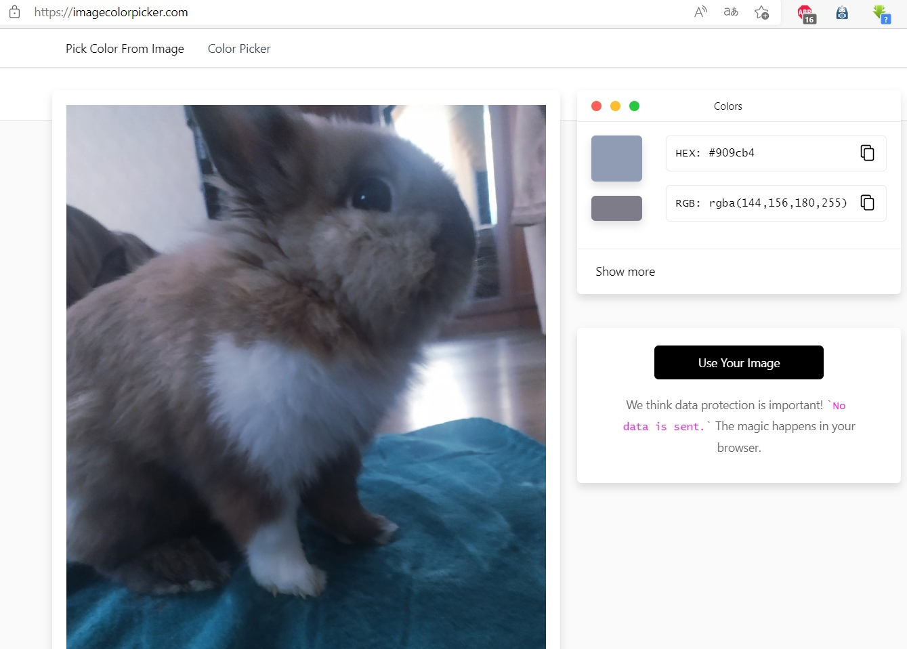
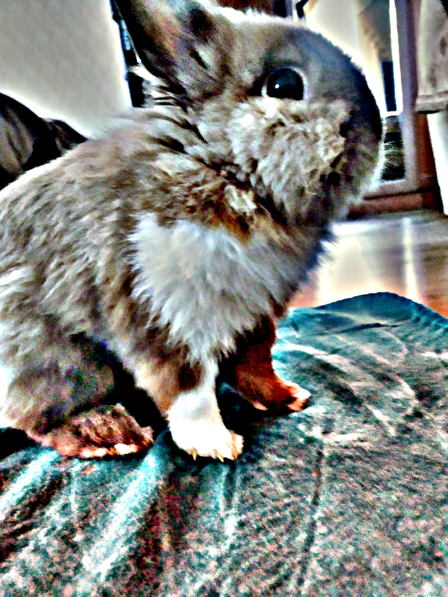
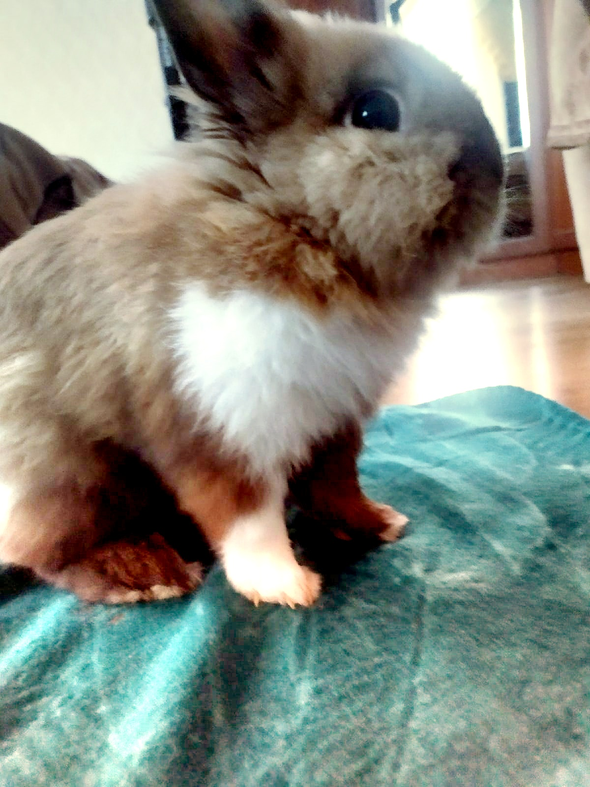

# Лабораторная работа 5. Баланс белого.
План работ:

Скачать цветное изображение по выбору с нарушенным цветовым балансом (желательно, чтобы на изображении был объект предположительно белого цвета).

Определить вручную цвет объекта, построить преобразование (матрицу 3х3) для коррекции белого. Применить к изображению. Не забудьте про нормировку яркости (если она будет нужна).


Определение цвета                          |  
:--------------------------------------:|
 |  
 
 Была построена матрица преобразования. Ниже приведен фрагмент кода, осуществляющий корректировку ББ с помощью матрицы:
```
private void whiteBalance(BufferedImage img) throws IOException {
    float[][] m = {
            {255/222f, 0, 0},
            {0, 255/243f, 0},
            {0, 0, 255/255f}
    };
    int h = img.getHeight();
    int w = img.getWidth();
    BufferedImage result = new BufferedImage(w, h, TYPE_INT_RGB);
    for (int i = 0; i < h; i++) {
        for (int j = 0; j < w; j++) {
            int color = img.getRGB(j, i);
            int r = ch1(color);
            int g = ch2(color);
            int b = ch3(color);
            int balancedColor = color(
                    Math.round(r * m[0][0] + g * m[0][1] + b * m[0][2]),
                    Math.round(r * m[1][0] + g * m[1][1] + b * m[1][2]),
                    Math.round(r * m[2][0] + g * m[2][1] + b * m[2][2])
            );
            result.setRGB(j, i, balancedColor);
        }
    }
    save(result, "result/whiteBalance", "result", FORMAT);
}
```
 
## Исходное изображение скорректировать согласно теории Серого мира вручную.

```
private void grayWorld(BufferedImage img) throws IOException {
    int h = img.getHeight();
    int w = img.getWidth();
    float avgRed = 0;
    float avgGreen = 0;
    float avgBlue = 0;
    for (int i = 0; i < h; i++) {
        for (int j = 0; j < w; j++) {
            int color = img.getRGB(j, i);
            avgRed += ch1(color);
            avgGreen += ch2(color);
            avgBlue += ch3(color);
        }
    }
    float pixelCount = h*w;
    avgRed = avgRed/pixelCount;
    avgGreen = avgGreen/pixelCount;
    avgBlue = avgBlue/pixelCount;
    float avgGray = (avgRed+avgGreen+avgBlue)/3f;
    float kr = avgGray/avgRed;
    float kg = avgGray/avgGreen;
    float kb = avgGray/avgBlue;
    BufferedImage result = new BufferedImage(w, h, TYPE_INT_RGB);
    for (int i = 0; i < h; i++) {
        for (int j = 0; j < w; j++) {
            int color = img.getRGB(j, i);
            int r = Math.round(ch1(color)*kr);
            int g = Math.round(ch2(color)*kg);
            int b = Math.round(ch3(color)*kb);
            if (r<0) r=0;
            if (g<0) g=0;
            if (b<0) b=0;
            result.setRGB(j, i, color(r, g, b));
        }
    }
    save(result, "result/grayWorld", "result", FORMAT);
}
```
## Исходное изображение скорректировать согласно теории Серого мира при помощи библиотечной функции.

```
private void grayWorldLib(BufferedImage img) throws IOException {
    Mat mat = new Mat();
    GrayworldWB alg = Xphoto.createGrayworldWB();
    alg.balanceWhite(img2Mat(img), mat);
    BufferedImage result = (BufferedImage) HighGui.toBufferedImage(mat);
    save(result, "result/grayWorldLib", "result", FORMAT);
}
```


Результат помощью матрицы | Результат (теория Серого мира вручную)    |  Результат (теория Серого мира библиотека)      | Оригинал
:----------------------------------------:|:---------------------------------------:|:--------------------------------------:|:--------------------------------------:|
   |    |  ||

## Библиотечная реализация метода Ретинекс
```
import numpy as np
import cv2

def singleScaleRetinex(img,variance):
    retinex = np.log10(img) - np.log10(cv2.GaussianBlur(img, (0, 0), variance))
    return retinex

def multiScaleRetinex(img, variance_list):
    retinex = np.zeros_like(img)
    for variance in variance_list:
        retinex += singleScaleRetinex(img, variance)
    retinex = retinex / len(variance_list)
    return retinex

   

def MSR(img, variance_list):
    img = np.float64(img) + 1.0
    img_retinex = multiScaleRetinex(img, variance_list)

    for i in range(img_retinex.shape[2]):
        unique, count = np.unique(np.int32(img_retinex[:, :, i] * 100), return_counts=True)
        for u, c in zip(unique, count):
            if u == 0:
                zero_count = c
                break            
        low_val = unique[0] / 100.0
        high_val = unique[-1] / 100.0
        for u, c in zip(unique, count):
            if u < 0 and c < zero_count * 0.1:
                low_val = u / 100.0
            if u > 0 and c < zero_count * 0.1:
                high_val = u / 100.0
                break            
        img_retinex[:, :, i] = np.maximum(np.minimum(img_retinex[:, :, i], high_val), low_val)
        
        img_retinex[:, :, i] = (img_retinex[:, :, i] - np.min(img_retinex[:, :, i])) / \
                               (np.max(img_retinex[:, :, i]) - np.min(img_retinex[:, :, i])) \
                               * 255
    img_retinex = np.uint8(img_retinex)        
    return img_retinex


def SSR(img, variance):
    img = np.float64(img) + 1.0
    img_retinex = singleScaleRetinex(img, variance)
    for i in range(img_retinex.shape[2]):
        unique, count = np.unique(np.int32(img_retinex[:, :, i] * 100), return_counts=True)
        for u, c in zip(unique, count):
            if u == 0:
                zero_count = c
                break            
        low_val = unique[0] / 100.0
        high_val = unique[-1] / 100.0
        for u, c in zip(unique, count):
            if u < 0 and c < zero_count * 0.1:
                low_val = u / 100.0
            if u > 0 and c < zero_count * 0.1:
                high_val = u / 100.0
                break            
        img_retinex[:, :, i] = np.maximum(np.minimum(img_retinex[:, :, i], high_val), low_val)
        
        img_retinex[:, :, i] = (img_retinex[:, :, i] - np.min(img_retinex[:, :, i])) / \
                               (np.max(img_retinex[:, :, i]) - np.min(img_retinex[:, :, i])) \
                               * 255
    img_retinex = np.uint8(img_retinex)        
    return img_retinex


variance_list=[15, 80, 30]
variance=300
    
img = cv2.imread('origReb.jpg')
img_msr=MSR(img,variance_list)
img_ssr=SSR(img, variance)


cv2.imwrite("rebMSR.jpg",img_msr)
cv2.imwrite('rebSSR.jpg',img_ssr)
```
 multiScaleRetinex | singleScaleRetinex    |   Оригинал
:----------------------------------------:|:---------------------------------------:|:--------------------------------------:|
   |    | |

 
